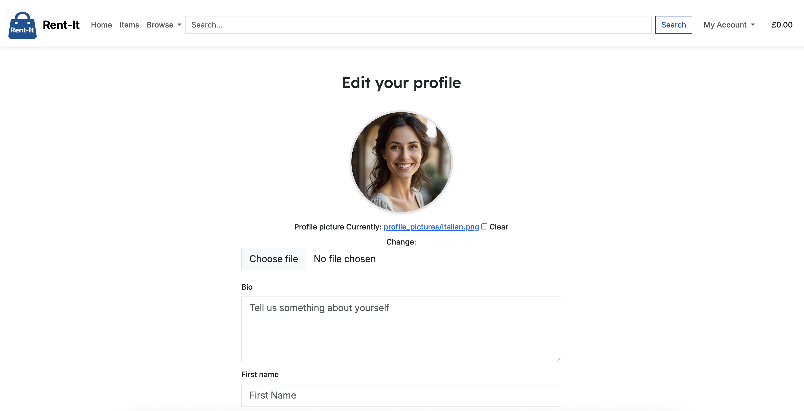
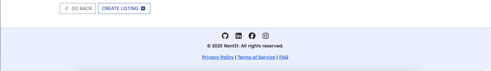

RENT - IT 
-----

## [CLICK HERE!](https://rent-it-705ae52973e4.herokuapp.com)

## Introduction  

RENT-IT is a modern rental marketplace designed for individuals who want easy access to everyday items without the cost of ownership.  
The platform enables users to list their products for rent and allows others to discover and book them through a seamless reservation system.  

With integrated date pickers, transparent pricing, security deposits, and a robust Stripe powered payment gateway, Rent-It ensures a reliable and user-friendly experience.  
Whether you’re renting out tools, electronics, or household essentials, RENT-IT makes sharing resources simple, secure, and convenient.  

## Objective

Our objective is to provide a sophisticated yet user friendly rental marketplace for people who need temporary access to everyday items. By focusing on high-quality listings, transparent pricing, and secure transactions, we aim to become the go to platform for anyone looking to save money, reduce waste, and enjoy the convenience of renting instead of buying.

## Audience

Our primary audience consists of individuals who prefer the flexibility of renting over buying, including those in need of tools, electronics, or household essentials for short-term use. We also cater to item owners who want to earn extra income by listing their products, creating a community driven platform that benefits both renters and lenders alike.

## Solution

Rent-It centralizes everything needed for a smooth rental experience comprehensive item listings, easy date-based reservations, transparent pricing, and secure checkout into one platform. By leveraging modern web technologies, the platform ensures consistent performance, user security, and seamless navigation across all devices.

## Scope

The scope of Rent-It covers item discovery, secure reservations and payments, rental management, and user generated listings that admins can oversee. By keeping the user interface intuitive and visually appealing, we streamline the entire rental journey from browsing and selecting dates to completing checkout with confidence.

# Business and Marketing Plan

## User Experience
We prioritize an elegant, intuitive user interface featuring a clean, modern design with responsive layouts that work seamlessly across devices. Users can effortlessly browse categories, filter search results by location or availability, add items to their rental bag, securely complete reservations with Stripe, and manage their accounts. All rental prices are transparent, with deposits and service fees clearly displayed before checkout, ensuring there are no hidden costs.

## Market
Rent-It operates within the growing sharing economy and peer-to-peer rental market, targeting individuals who prefer access over ownership. This includes people who need tools, electronics, or household items for temporary use, as well as owners who want to monetize underused belongings. By focusing on trust, security, and convenience, Rent-It distinguishes itself from generic marketplaces by offering a streamlined rental-first platform.

## Revenue Model
Our platform follows a commission-based model, generating profit through a site fee on every transaction. This approach ensures fair pricing for renters, extra income for lenders, and a sustainable revenue stream for Rent-It. Deposits are securely managed to protect owners against potential damages.

## Marketing
Our marketing strategy combines targeted social media campaigns, local advertising, and collaborations with content creators in the sustainability and DIY communities. We share engaging content that emphasizes the benefits of renting over buying—saving money, reducing waste, and building community connections. 

## Risks
- Trust and Reliability: Potential misuse or damages could harm community trust.
- Market Competition: Competing rental platforms or second-hand marketplaces may attract similar audiences.
- Operational Scalability: Rapid user growth could strain payment handling, customer support, or dispute resolution.
-  Regulatory Changes: Shifts in consumer rights, insurance, or rental regulations may impact operations.

## Growth Opportunities
- Expanded Categories: Introduce rentals for larger items (e.g. vehicles, equipment) or niche markets (e.g. photography gear).
- Partnerships: Collaborate with local businesses and repair shops to offer verified, high-quality rentals.
- Premium Services: Provide insurance add-ons, delivery/pick-up options, or subscription-based membership benefits.

## Agile Methodology User Stories

The development of Rent-It followed Agile principles, ensuring that the project could evolve iteratively with constant feedback and incremental improvements. Instead of building everything at once, the application was divided into smaller deliverables  each representing a core area of functionality (e.g., authentication, rental bag, payments, account management).

[All the User Stories are available here - please click.](https://github.com/users/GrzegorzStary/projects/6d)

## UX

- Design Philosophy
The design philosophy of Rent-It focuses on creating a clean, modern, and user friendly interface. The website offers a smooth and intuitive flow, ensuring users can browse, list, and rent items without ever feeling lost or overwhelmed. Every element is structured to balance functionality with simplicity, making the rental journey straightforward and enjoyable.

- Colour Scheme and Fonts
The website features a primary color scheme of deep blue and light neutral tones, conveying trust, reliability, and clarity. Accent colors are used sparingly to highlight buttons, alerts, and key actions, guiding users effortlessly through the site.

- For typography, headings use a bold sans-serif font to emphasize clarity and modernity, while body text relies on a clean, legible serif/sans-serif pairing that ensures readability across all devices. This combination provides both a professional identity and a smooth reading experience.

- Lexend Deca

- INTER

# FEATURES

  
WIREFRAMES

### HOME PAGE

### ITEM PAGE

### ITEM DETAIL

### YOUR RENTAL BAG

### CHECKOUT

### ORDER OVERVIEW

### PROFILE PAGE

### EDIT PROFILE

### CREATE LISTING

### LISTED ITEMS

### RENTED ITEMS

  
EXISTING FEATURES

  ### HOME PAGE

#### Navigation Bar:
- Positioned at the top of the page with links to Home, Items, Browse, and a Search bar for easy item discovery.
- A dropdown My Account menu for login, profile, and user account management.
- A clear basket/checkout indicator showing the current rental total (£0.00 in this case).
- A large banner image carousel highlighting promotional visuals.
- Text overlay: “Done with it?” - encouraging users to rent out unused items.
- Positioned prominently to grab user attention immediately upon visiting.
- Displays the latest items added to the platform, including images, names, and clickable item cards.
- Example items shown: Guitar, Garden Furniture Set, Bike, Toy Car for Toddlers, Lawn Mower.
- Each item image is styled for clarity, encouraging engagement.
- Contains social media icons for external platform access.
- Includes important quick links: Privacy Policy, Terms of Service, and FAQ.

#### MOBILE

### ITEM PAGE

- Consistent Design for header and footer section

- A Max Distance (km) input field allows users to set a search radius.
- A “Near Me” button filters results based on the user’s location, ensuring only nearby items are displayed.
- Items are displayed in a responsive grid format with images, titles, prices, and short descriptions.
- Each item card is clickable, leading to the Item Detail Page with full information.
Guitar – £9.00 – “6 string GITARRRA!!!!”
Garden Furniture Set – £10.00 – Table + 2 chairs.
Awesome Bike – £15.00 – Bicycle in great condition.
Consistent Design:

#### MOBILE

### ITEM DETAIL

- Large product image with carousel functionality for multiple photos.
- Clear title, price, and distance from the user’s location.
- Short description highlighting the item details.
- Start Date and End Date selection fields with integrated calendar pickers.
- Instructional note: “Select dates to see the price breakdown.”
- Buttons for “Keep Browsing” or “Rent It!” to proceed with the rental.
- Consistent with the rest of the site for seamless navigation.

#### MOBILE

### PROFILE PAGE

- Displays the logged-in user’s profile information.
- User’s name is shown as the profile heading.
- Edit Profile – Update personal details and address.
- Create a Listing – Add a new item to the marketplace.
- Your Listings – View and manage items the user has listed for rent.
- Rented Items – View rental history and current reservations.
- Go Back – Return to the previous page.
- Consistent with the rest of the site for smooth navigation.

#### MOBILE

### PROFILE EDIT

- Users can upload or change their profile picture.
- Editable bio field to add a short personal description.
- Editable fields for first name, last name, house number, street name, city, and postal code.
- Designed to keep user details up to date for accurate rental and delivery information.
- Cancel - Discards changes and returns to the profile page.
- Save Changes - Saves updates to the profile.
- Consistent with the rest of the site for smooth navigation.

#### MOBILE

#### Create Listing

- Fields to add item details including Name, Description, Price, Deposit, and SKU.
- Image upload option to attach one or more photos of the item.
- Go Back - Returns to the previous page.
- Create Listing – Submits the form to publish the item on the platform.
- Consistent with the rest of the site for smooth navigation.

#### MOBILE

#### LISTED ITEMS

- Displays all items added by the logged-in user.
- Each item card shows the image, title, price, and short description.
- Visibility Toggle - Option to make the item visible or hidden from renters.
- Edit - Opens the item for editing details.
- Open – Views the full item detail page as seen by renters.
- Go Back – Returns to the profile page.
- Consistent with the rest of the site for smooth navigation.

#### MOBILE

### RENTED ITEMS PAGE

- Displays detailed information for each completed rental order.
- Includes order number, date of booking, and item rented.
- Shows item image, title, rental period, and daily price.
- Pickup details include owner’s name, email, and address.
- Rental total - Base rental cost.
- Deposit total - Refundable security deposit.
- Site fee (10%) - Platform service fee.
- Delivery - Delivery cost (if applicable).
- Grand total - Final amount paid by the renter.
- Go Back - Returns to the profile page.
- Consistent with the rest of the site for smooth navigation.

#### MOBILE

### DELETE LISTING PAGE

- This page provides a confirmation prompt when a user chooses to delete one of their listed items.
- It displays the item name to avoid accidental deletions.
- Back to safety – Cancels the action and returns the user to their profile or listings.
- Yes, delete! – Permanently removes the item from the platform.
- The layout is consistent with the rest of the site, maintaining the same header and footer structure.
- Only the item owner or a superuser has permission to delete a listing.

#### MOBILE

### PRIVACY POLICY

- Displays the site’s official Privacy Policy, outlining how user data is collected, used, and protected.
- Structured into 9 main sections, each covering a specific area such as information collection, usage, sharing, and legal compliance.
- Provides users with transparency and builds trust in the platform.
- Consistent with the rest of the site for smooth navigation.

#### MOBILE

##### SHORTENED VERSION BY 5 POINTS

### TERMS OF SERVICE

- Displays the platform’s official Terms of Service, outlining the rules and responsibilities for using Rent-It.
- Structured into numbered sections covering acceptance of terms, use of services, payments and cancellations, prohibited activities, and other legal conditions.
- Ensures transparency and provides users with clear guidelines before engaging with the platform.

#### MOBILE

##### SHORTENED VERSION BY 6 POINTS

### FAQ

- Displays a Frequently Asked Questions section to help users understand how Rent-It works.
- Organized as an accordion layout where questions expand to reveal answers.
- Covers key topics such as:
- How Rent-It works
- Who can use the platform

#### MOBILE

### CUSTOM 404, 500, 403 PAGES

- Custom error page templates are implemented to provide users with a clear message and an option to navigate back to safety.
- A sample 404 error page is shown below; the 500 and 403 error pages follow the same consistent design.

#### MOBILE

### Authentication System

- The application includes a complete authentication system powered by Django Allauth, ensuring secure and user-friendly account management.
- Account Creation - Users can register with their email, confirm their details, and set a secure password. 
- Social sign-up via Google and GitHub is also available for convenience.
- Login / Logout - Secure login with username or email, plus logout functionality.
- Profile Management - Once registered, users can edit their personal details, including profile picture, address, and bio.
- Password Management - Users can reset forgotten passwords, change existing ones, and confirm changes via email verification.
- Email Verification - Sign-ups require email confirmation to ensure authenticity and security.
- Error Handling - Informative error pages guide users in case of login, verification, or inactive account issues.
- The template file structure supports all authentication-related operations, including: signup.html / login.html
- Password reset (password_reset.html, password_reset_done.html, password_set.html)
- Email confirmation (email_confirm.html, verification_sent.html)
- Session and security pages (reauthenticate.html, account_inactive.html)
- This structure ensures a consistent user experience, with ALL authentication templates following the same layout as the rest of the site (shared header, footer, and styling).

##### All authentication templates following the same layout as the rest of the site

#### MOBILE

## Languages

- HTML
- CSS
- Java Script
- Python