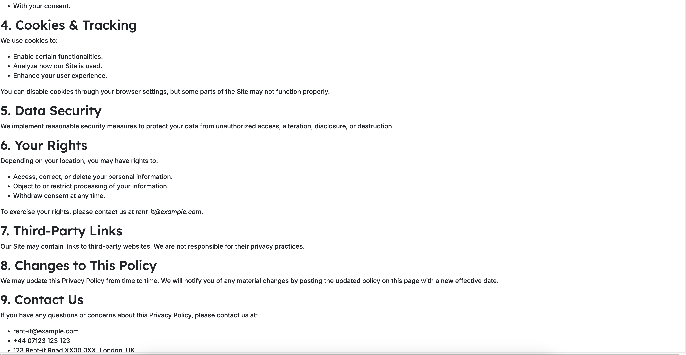
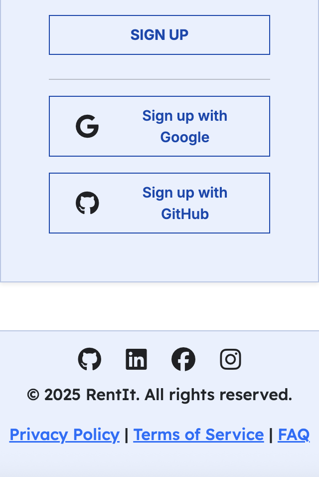

RENT - IT 
-----


# [CLICK HERE TO VIEW THE PROJECT!](https://rent-it-705ae52973e4.herokuapp.com)

### Important:
To get the most out of the site, please register and then head over to your profile to fill in your details.
Make sure you use a valid address within 60 miles of:
```
Boothferry Rd, Goole DN14 6BB.
```
- All items are currently located around this postcode.
- If you enter your real postcode but it’s outside this radius, the site may show no results.
- Also, please consider adding your own items for listing! 
The more genuine listings we have, the better the future marketplace will be, not just my dummy items.

#### If you’d like to try renting an item on the site, please use the following dummy card details:

- Card Number: 4242 4242 4242 4242
- Expiry Date: 04/26
- CVC: 424
- ZIP: 24242

#### In short: 4242 4242 4242 4242 04/26 424 24242

These are Stripe test card details, so no real money is charged.


## Introduction  

RENT-IT is a modern rental marketplace designed for individuals who want easy access to everyday items without the cost of ownership.  
The platform enables users to list their products for rent and allows others to discover and book them through a seamless reservation system.  

With integrated date pickers, transparent pricing, security deposits, and a robust Stripe powered payment gateway, Rent-It ensures a reliable and user-friendly experience.  
Whether you’re renting out tools, electronics, or household essentials, RENT-IT makes sharing resources simple, secure, and convenient.

## Objective

Our objective is to provide a sophisticated yet user friendly rental marketplace for people who need temporary access to everyday items. By focusing on high-quality listings, transparent pricing, and secure transactions, we aim to become the go to platform for anyone looking to save money, reduce waste, and enjoy the convenience of renting instead of buying.

## Audience

Our primary audience consists of individuals who prefer the flexibility of renting over buying, including those in need of tools, electronics, or household essentials for short-term use. We also cater to item owners who want to earn extra income by listing their products, creating a community driven platform that benefits both renters and lenders alike.

## Solution

Rent-It centralizes everything needed for a smooth rental experience comprehensive item listings, easy date-based reservations, transparent pricing, and secure checkout into one platform. By leveraging modern web technologies, the platform ensures consistent performance, user security, and seamless navigation across all devices.

## Scope

The scope of Rent-It covers item discovery, secure reservations and payments, rental management, and user generated listings that admins can oversee. By keeping the user interface intuitive and visually appealing, we streamline the entire rental journey from browsing and selecting dates to completing checkout with confidence.

# Business and Marketing Plan

## User Experience
We prioritize an elegant, intuitive user interface featuring a clean, modern design with responsive layouts that work seamlessly across devices. Users can effortlessly browse categories, filter search results by location or availability, add items to their rental bag, securely complete reservations with Stripe, and manage their accounts. All rental prices are transparent, with deposits and service fees clearly displayed before checkout, ensuring there are no hidden costs.

## Market
Rent-It operates within the growing sharing economy and peer-to-peer rental market, targeting individuals who prefer access over ownership. This includes people who need tools, electronics, or household items for temporary use, as well as owners who want to monetize underused belongings. By focusing on trust, security, and convenience, Rent-It distinguishes itself from generic marketplaces by offering a streamlined rental-first platform.

## Revenue Model
Our platform follows a commission-based model, generating profit through a site fee on every transaction. This approach ensures fair pricing for renters, extra income for lenders, and a sustainable revenue stream for Rent-It. Deposits are securely managed to protect owners against potential damages.

## Marketing
Our marketing strategy combines targeted social media campaigns, local advertising, and collaborations with content creators in the sustainability and DIY communities. We share engaging content that emphasizes the benefits of renting over buying - saving money, reducing waste, and building community connections. 

## Risks
- Trust and Reliability: Potential misuse or damages could harm community trust.
- Market Competition: Competing rental platforms or second-hand marketplaces may attract similar audiences.
- Operational Scalability: Rapid user growth could strain payment handling, customer support, or dispute resolution.
-  Regulatory Changes: Shifts in consumer rights, insurance, or rental regulations may impact operations.

## Growth Opportunities
- Expanded Categories: Introduce rentals for larger items (e.g. vehicles, equipment) or niche markets (e.g. photography gear).
- Partnerships: Collaborate with local businesses and repair shops to offer verified, high-quality rentals.
- Premium Services: Provide insurance add-ons, delivery/pick-up options, or subscription-based membership benefits.

## Agile Methodology User Stories

The development of Rent-It followed Agile principles, ensuring that the project could evolve iteratively with constant feedback and incremental improvements. Instead of building everything at once, the application was divided into smaller deliverables  each representing a core area of functionality (e.g., authentication, rental bag, payments, account management).

[All the User Stories are available here - please click.](https://github.com/users/GrzegorzStary/projects/6d)

## Future Features

#### Note: There are still 5 pending user stories, as Rent-It is currently under active development. These features will be added in future iterations:

- Approve or Reject Rental Requests - Allow item owners to manually confirm or decline rental bookings.
- Enable Ratings and Reviews - Provide a feedback system where renters can rate items and leave comments.
- View Platform Activity Analytics - Dashboard for admins to monitor rentals, revenue, and user engagement.
- Manage Duplicate Listings - Automated or manual detection and removal of duplicate item entries.
- Leave a Review After Rental - Renters can submit reviews once their rental period has ended.


## UX

- Design Philosophy
The design philosophy of Rent-It focuses on creating a clean, modern, and user friendly interface. The website offers a smooth and intuitive flow, ensuring users can browse, list, and rent items without ever feeling lost or overwhelmed. Every element is structured to balance functionality with simplicity, making the rental journey straightforward and enjoyable.

- Colour Scheme and Fonts
The website features a primary color scheme of deep blue and light neutral tones, conveying trust, reliability, and clarity. Accent colors are used sparingly to highlight buttons, alerts, and key actions, guiding users effortlessly through the site.


- For typography, headings use a bold sans-serif font to emphasize clarity and modernity, while body text relies on a clean, legible serif/sans-serif pairing that ensures readability across all devices. This combination provides both a professional identity and a smooth reading experience.

- Lexend Deca


- INTER


# FEATURES

<details>
  <summary>WIREFRAMES</summary>

### HOME PAGE


### ITEM PAGE


### ITEM DETAIL


### YOUR RENTAL BAG


### CHECKOUT


### ORDER OVERVIEW


### PROFILE PAGE


### EDIT PROFILE


### CREATE LISTING


### LISTED ITEMS


### RENTED ITEMS


</details>


<details>
  <summary>EXISTING FEATURES</summary>


  ### HOME PAGE

#### Navigation Bar:
- Positioned at the top of the page with links to Home, Items, Browse, and a Search bar for easy item discovery.
- A dropdown My Account menu for login, profile, and user account management.
- A clear basket/checkout indicator showing the current rental total (£0.00 in this case).
- A large banner image carousel highlighting promotional visuals.
- Text overlay: “Done with it?” - encouraging users to rent out unused items.
- Positioned prominently to grab user attention immediately upon visiting.
- Displays the latest items added to the platform, including images, names, and clickable item cards.
- Example items shown: Guitar, Garden Furniture Set, Bike, Toy Car for Toddlers, Lawn Mower.
- Each item image is styled for clarity, encouraging engagement.
- Contains social media icons for external platform access.
- Includes important quick links: Privacy Policy, Terms of Service, and FAQ.


#### MOBILE


### ITEM PAGE

- Consistent Design for header and footer section

- A Max Distance (km) input field allows users to set a search radius.
- A “Near Me” button filters results based on the user’s location, ensuring only nearby items are displayed.
- Items are displayed in a responsive grid format with images, titles, prices, and short descriptions.
- Each item card is clickable, leading to the Item Detail Page with full information.
Guitar – £9.00 – “6 string GITARRRA!!!!”
Garden Furniture Set – £10.00 – Table + 2 chairs.
Awesome Bike – £15.00 – Bicycle in great condition.
Consistent Design:


#### MOBILE


### ITEM DETAIL

- Large product image with carousel functionality for multiple photos.
- Clear title, price, and distance from the user’s location.
- Short description highlighting the item details.
- Start Date and End Date selection fields with integrated calendar pickers.
- Instructional note: “Select dates to see the price breakdown.”
- Buttons for “Keep Browsing” or “Rent It!” to proceed with the rental.
- Consistent with the rest of the site for seamless navigation.


#### MOBILE


### PROFILE PAGE

- Displays the logged-in user’s profile information.
- User’s name is shown as the profile heading.
- Edit Profile – Update personal details and address.
- Create a Listing – Add a new item to the marketplace.
- Your Listings – View and manage items the user has listed for rent.
- Rented Items – View rental history and current reservations.
- Go Back – Return to the previous page.
- Consistent with the rest of the site for smooth navigation.


#### MOBILE


### PROFILE EDIT

- Users can upload or change their profile picture.
- Editable bio field to add a short personal description.
- Editable fields for first name, last name, house number, street name, city, and postal code.
- Designed to keep user details up to date for accurate rental and delivery information.
- Cancel - Discards changes and returns to the profile page.
- Save Changes - Saves updates to the profile.
- Consistent with the rest of the site for smooth navigation.


#### MOBILE


#### Create Listing

- Fields to add item details including Name, Description, Price, Deposit, and SKU.
- Image upload option to attach one or more photos of the item.
- Go Back - Returns to the previous page.
- Create Listing – Submits the form to publish the item on the platform.
- Consistent with the rest of the site for smooth navigation.


#### MOBILE


#### LISTED ITEMS

- Displays all items added by the logged-in user.
- Each item card shows the image, title, price, and short description.
- Visibility Toggle - Option to make the item visible or hidden from renters.
- Edit - Opens the item for editing details.
- Open – Views the full item detail page as seen by renters.
- Go Back – Returns to the profile page.
- Consistent with the rest of the site for smooth navigation.


#### MOBILE


### RENTED ITEMS PAGE

- Displays detailed information for each completed rental order.
- Includes order number, date of booking, and item rented.
- Shows item image, title, rental period, and daily price.
- Pickup details include owner’s name, email, and address.
- Rental total - Base rental cost.
- Deposit total - Refundable security deposit.
- Site fee (10%) - Platform service fee.
- Delivery - Delivery cost (if applicable).
- Grand total - Final amount paid by the renter.
- Go Back - Returns to the profile page.
- Consistent with the rest of the site for smooth navigation.


#### MOBILE


### DELETE LISTING PAGE

- This page provides a confirmation prompt when a user chooses to delete one of their listed items.
- It displays the item name to avoid accidental deletions.
- Back to safety – Cancels the action and returns the user to their profile or listings.
- Yes, delete! – Permanently removes the item from the platform.
- The layout is consistent with the rest of the site, maintaining the same header and footer structure.
- Only the item owner or a superuser has permission to delete a listing.


#### MOBILE


### PRIVACY POLICY

- Displays the site’s official Privacy Policy, outlining how user data is collected, used, and protected.
- Structured into 9 main sections, each covering a specific area such as information collection, usage, sharing, and legal compliance.
- Provides users with transparency and builds trust in the platform.
- Consistent with the rest of the site for smooth navigation.





#### MOBILE

##### SHORTENED VERSION BY 5 POINTS


### TERMS OF SERVICE

- Displays the platform’s official Terms of Service, outlining the rules and responsibilities for using Rent-It.
- Structured into numbered sections covering acceptance of terms, use of services, payments and cancellations, prohibited activities, and other legal conditions.
- Ensures transparency and provides users with clear guidelines before engaging with the platform.


#### MOBILE

##### SHORTENED VERSION BY 6 POINTS


### FAQ

- Displays a Frequently Asked Questions section to help users understand how Rent-It works.
- Organized as an accordion layout where questions expand to reveal answers.
- Covers key topics such as:
- How Rent-It works
- Who can use the platform


#### MOBILE


### CUSTOM 404, 500, 403 PAGES

- Custom error page templates are implemented to provide users with a clear message and an option to navigate back to safety.
- A sample 404 error page is shown below; the 500 and 403 error pages follow the same consistent design.


#### MOBILE


### Authentication System

- The application includes a complete authentication system powered by Django Allauth, ensuring secure and user-friendly account management.
- Account Creation - Users can register with their email, confirm their details, and set a secure password. 
- Social sign-up via Google and GitHub is also available for convenience.
- Login / Logout - Secure login with username or email, plus logout functionality.
- Profile Management - Once registered, users can edit their personal details, including profile picture, address, and bio.
- Password Management - Users can reset forgotten passwords, change existing ones, and confirm changes via email verification.
- Email Verification - Sign-ups require email confirmation to ensure authenticity and security.
- Error Handling - Informative error pages guide users in case of login, verification, or inactive account issues.
- The template file structure supports all authentication-related operations, including: signup.html / login.html
- Password reset (password_reset.html, password_reset_done.html, password_set.html)
- Email confirmation (email_confirm.html, verification_sent.html)
- Session and security pages (reauthenticate.html, account_inactive.html)
- This structure ensures a consistent user experience, with ALL authentication templates following the same layout as the rest of the site (shared header, footer, and styling).


##### All authentication templates following the same layout as the rest of the site


#### MOBILE



</details>

## Languages

- HTML
- CSS
- Java Script
- Python

## Frameworks and Tools

- Git
- Github
- Google Fonts
- Visual Studio Code
- Django
- PostgreSQL
- Heroku
- Gunicorn
- Bootstrap
- sycopg2
- Balsamiq
- CodeInstitute Database
- Mizframa - Mockup generator app
- Tempus Dominus - Datepicker
- postcodes.io - For distance badge and owner/renter postcode location

## DATABASE DESIGN

### USER AND PROFILES

| Column                           | Type         | Description                              |
| -------------------------------- | ------------ | ---------------------------------------- |
| `id`                             | INT (PK)     | Unique identifier for each user.         |
| `username`                       | VARCHAR(150) | Username (from Django’s default `User`). |
| `email`                          | VARCHAR(255) | User email.                              |
| `password`                       | VARCHAR(255) | Hashed password.                         |
| `is_superuser`                   | BOOLEAN      | Marks admin/superuser status.            |
| `is_active`                      | BOOLEAN      | Whether account is active.               |
| **Profile Table (extends User)** |              |                                          |
| `profile_id`                     | INT (PK)     | Profile ID.                              |
| `user_id`                        | INT (FK)     | Linked to User.                          |
| `first_name`                     | VARCHAR(100) | User’s first name.                       |
| `last_name`                      | VARCHAR(100) | User’s last name.                        |
| `avatar`                         | VARCHAR(255) | Profile picture URL.                     |
| `bio`                            | TEXT         | Short description about the user.        |
| `phone_number`                   | VARCHAR(20)  | Contact number.                          |
| `address`                        | VARCHAR(255) | Street address.                          |
| `city`                           | VARCHAR(100) | City.                                    |
| `postal_code`                    | VARCHAR(20)  | Postcode.                                |
| `latitude`                       | DECIMAL(9,6) | Geo latitude (for distance calc).        |
| `longitude`                      | DECIMAL(9,6) | Geo longitude (for distance calc).       |


### ITEMS / LISTINGS

| Column                              | Type          | Description                             |
| ----------------------------------- | ------------- | --------------------------------------- |
| `item_id`                           | INT (PK)      | Unique identifier for item.             |
| `owner_id`                          | INT (FK)      | Linked to Profile (item owner).         |
| `name`                              | VARCHAR(255)  | Item name.                              |
| `description`                       | TEXT          | Detailed description.                   |
| `price_per_day`                     | DECIMAL(10,2) | Rental price per day.                   |
| `deposit`                           | DECIMAL(10,2) | Refundable deposit.                     |
| `sku`                               | VARCHAR(50)   | Stock keeping unit.                     |
| `condition`                         | VARCHAR(100)  | Item condition (e.g., New, Used, Good). |
| `category`                          | VARCHAR(100)  | Category or tag.                        |
| `address`                           | VARCHAR(255)  | Pickup location.                        |
| `city`                              | VARCHAR(100)  | City of item.                           |
| `postal_code`                       | VARCHAR(20)   | Postcode of item.                       |
| `latitude`                          | DECIMAL(9,6)  | Geo latitude.                           |
| `longitude`                         | DECIMAL(9,6)  | Geo longitude.                          |
| `created_at`                        | DATETIME      | Date listed.                            |
| `updated_at`                        | DATETIME      | Last update.                            |
| **Item Images (multiple per item)** |               |                                         |
| `image_id`                          | INT (PK)      | Unique image identifier.                |
| `item_id`                           | INT (FK)      | Linked to item.                         |
| `image_url`                         | VARCHAR(255)  | Path to image file.                     |


### RESERVATIONS / RENTALS

| Column             | Type          | Description                                 |
| ------------------ | ------------- | ------------------------------------------- |
| `reservation_id`   | INT (PK)      | Unique reservation.                         |
| `item_id`          | INT (FK)      | Linked to item.                             |
| `renter_id`        | INT (FK)      | Linked to Profile (renter).                 |
| `owner_id`         | INT (FK)      | Linked to Profile (owner).                  |
| `start_date`       | DATE          | Rental start date.                          |
| `end_date`         | DATE          | Rental end date.                            |
| `duration_days`    | INT           | Total rental duration.                      |
| `reservation_code` | VARCHAR(50)   | Unique confirmation code.                   |
| `total_price`      | DECIMAL(10,2) | Total rental price.                         |
| `deposit_amount`   | DECIMAL(10,2) | Deposit held.                               |
| `status`           | VARCHAR(50)   | e.g. Pending, Confirmed, Active, Completed. |
| `created_at`       | DATETIME      | Reservation created.                        |


### CHECKOUT PAYMENT (STRIPE)

| Column              | Type          | Description                  |
| ------------------- | ------------- | ---------------------------- |
| `payment_id`        | INT (PK)      | Payment record.              |
| `reservation_id`    | INT (FK)      | Linked to Reservation.       |
| `stripe_payment_id` | VARCHAR(255)  | Stripe transaction ID.       |
| `amount`            | DECIMAL(10,2) | Amount charged.              |
| `site_fee`          | DECIMAL(10,2) | Platform fee (10%).          |
| `payment_status`    | VARCHAR(50)   | Success / Failed / Refunded. |
| `created_at`        | DATETIME      | Payment timestamp.           |


### Access & Permissions
- Only item owners and superusers can delete a listing.
- Superusers can moderate reviews and manage users/items.

## Testing

For all testing, please refer to the [TESTING.md](TESTING.md) 

## Deployment

The live deployed application can be found deployed on [Heroku](rent-it-705ae52973e4.herokuapp.com/).

### Heroku Deployment

This project uses [Heroku](https://www.heroku.com), a platform as a service (PaaS) that enables developers to build, run, and operate applications entirely in the cloud.

Deployment steps are as follows, after account setup:

- Select **New** in the top-right corner of your Heroku Dashboard, and select **Create new app** from the dropdown menu.
- Your app name must be unique, and then choose a region closest to you (EU or USA), and finally, select **Create App**.
- From the new app **Settings**, click **Reveal Config Vars**, and set your environment variables.

| Key | Value |
| --- | --- |
| `DATABASE_URL` | user's own value |
| `DISABLE_COLLECTSTATIC` | 1 (*this is temporary, and can be removed for the final deployment*) |
| `SECRET_KEY` | user's own value |

Heroku needs two additional files in order to deploy properly.
- requirements.txt
- Procfile

You can install this project's **requirements** (where applicable) using:
- `pip3 install -r requirements.txt`

If you have your own packages that have been installed, then the requirements file needs updated using:
- `pip3 freeze --local > requirements.txt`

The **Procfile** can be created with the following command:
- `echo web: gunicorn app_name.wsgi > Procfile`
- *replace **app_name** with the name of your primary Django app name; the folder where settings.py is located*

For Heroku deployment, follow these steps to connect your own GitHub repository to the newly created app:

Either:
- Select **Automatic Deployment** from the Heroku app.

Or:
- In the Terminal/CLI, connect to Heroku using this command: `heroku login -i`
- Set the remote for Heroku: `heroku git:remote -a app_name` (replace *app_name* with your app name)
- After performing the standard Git `add`, `commit`, and `push` to GitHub, you can now type:
- `git push heroku main`

The project should now be connected and deployed to Heroku!

### Google Mail Setup

To enable email notifications (order confirmations, password resets, etc.) Rent-It is configured to use Gmail SMTP. Follow these steps to set up your Gmail account and integrate it with the project:

#### Create / Use a Gmail account
This account will act as the sender for Rent-It emails.

#### Enable 2-Step Verification
- Log in to Gmail
- Navigate to:
Settings → Other Google Account Settings → Security
- Turn on 2-Step Verification

#### Generate an App Password
- After 2FA is enabled, go to:
- Security → App Passwords
- Select Other (Custom name) → enter e.g. RentIt
- Click Create
- Copy the 16-digit password provided (you’ll need it for Heroku).

#### Configure Django email backend
- In settings.py:
```python
if 'DEVELOPMENT' in os.environ:
    EMAIL_BACKEND = 'django.core.mail.backends.console.EmailBackend'
    DEFAULT_FROM_EMAIL = 'rentit@example.com'
else:
    EMAIL_BACKEND = 'django.core.mail.backends.smtp.EmailBackend'
    EMAIL_USE_TLS = True
    EMAIL_PORT = 587
    EMAIL_HOST = 'smtp.gmail.com'
    EMAIL_HOST_USER = os.environ.get('EMAIL_HOST_USER')
    EMAIL_HOST_PASSWORD = os.environ.get('EMAIL_HOST_PASSWORD')
    DEFAULT_FROM_EMAIL = os.environ.get('EMAIL_HOST_USER')
```

#### Set Heroku Config Vars

- In your Heroku dashboard, add the following under Settings → Config Vars:

```ini
EMAIL_HOST_USER = your_gmail_address@gmail.com
EMAIL_HOST_PASS = your_16_digit_app_password
```

### AWS S3 Bucket Config

 Rent-It uses Amazon Web Services (AWS S3) to store and serve static and media files (CSS, JS, images, product photos). Follow the steps below to configure AWS for your project:

1. Setup AWS Account & S3 Bucket
- Log in to your AWS account.
- Create a new S3 Bucket → name it the same as your Heroku app (e.g., rent-it-static).
- Choose the AWS region closest to your location.
- Block Public Access → uncheck "Block all public access".
- Confirm that the bucket will be public (required for hosting static files).
- Object Ownership → set to ACLs Enabled → Bucket owner preferred.
- In Properties tab, enable Static Website Hosting and set:
```
Index document: index.html
Error document: error.html
```
- In Permissions → CORS configuration, paste the following:

```json
[
  {
    "AllowedHeaders": ["Authorization"],
    "AllowedMethods": ["GET"],
    "AllowedOrigins": ["*"],
    "ExposeHeaders": []
  }
]
```

- Copy your bucket ARN string (used for bucket policy).

2. S3 Bucket Policy
In Bucket Policy tab, click Policy Generator and create a policy:
- Policy Type: S3 Bucket Policy
- Effect: Allow
- Principal: *
- Actions: GetObject
- Resource: arn:aws:s3:::bucket-name/*

Paste the generated JSON into the Bucket Policy Editor. Example:

```json
{
  "Id": "Policy1234567890",
  "Version": "2012-10-17",
  "Statement": [
    {
      "Sid": "Stmt1234567890",
      "Action": ["s3:GetObject"],
      "Effect": "Allow",
      "Resource": "arn:aws:s3:::rent-it-static/*",
      "Principal": "*"
    }
  ]
}
```

- Make sure /* is added at the end of the Resource key.
Save the policy.
In Access Control List (ACL) → Edit → enable List for Everyone (Public Access) → accept warning.

3. AWS IAM Setup
- Go to IAM (Identity & Access Management).
- Create a new User Group → e.g., rent-it-group.
- Attach policy → AmazonS3FullAccess.
- Create a new Policy with the following JSON (replace bucket name):

```json
{
  "Version": "2012-10-17",
  "Statement": [
    {
      "Effect": "Allow",
      "Action": "s3:*",
      "Resource": [
        "arn:aws:s3:::rent-it-static",
        "arn:aws:s3:::rent-it-static/*"
      ]
    }
  ]
}
```

- Review → name it rent-it-policy → create policy.
- Attach the policy to your group.
- Create a new User → e.g., rent-it-user → Programmatic access.
- Add the user to your group.
- Download the .csv file with Access Key ID and Secret Access Key.

These values will be added to Heroku Config Vars:

```ini
AWS_ACCESS_KEY_ID = <your access key id>
AWS_SECRET_ACCESS_KEY = <your secret access key>
```

4. Media Folder Setup
- In Heroku Config Vars, remove DISABLE_COLLECTSTATIC.
- In AWS S3 bucket, create a media folder.
- Upload project images → set permissions to public read access.

5. Install Dependencies
In your local environment:

```bash
pip install boto3
pip install django-storages
```

Update INSTALLED_APPS in settings.py:
```python
INSTALLED_APPS = [
    ...
    'storages',
]
```

6. Django AWS Configuration
Add the following to settings.py:

```python
if 'USE_AWS' in os.environ:
    # Cache Control
    AWS_S3_OBJECT_PARAMETERS = {
        'Expires': 'Thu, 31 Dec 2099 20:00:00 GMT',
        'CacheControl': 'max-age=9460800',
    }

    # Bucket Config
    AWS_STORAGE_BUCKET_NAME = 'rent-it-static'
    AWS_S3_REGION_NAME = 'eu-west-1'  # update to your region
    AWS_ACCESS_KEY_ID = os.environ.get('AWS_ACCESS_KEY_ID')
    AWS_SECRET_ACCESS_KEY = os.environ.get('AWS_SECRET_ACCESS_KEY')
    AWS_S3_CUSTOM_DOMAIN = f'{AWS_STORAGE_BUCKET_NAME}.s3.amazonaws.com'

    # Static & Media
    STATICFILES_STORAGE = 'custom_storages.StaticStorage'
    STATICFILES_LOCATION = 'static'
    DEFAULT_FILE_STORAGE = 'custom_storages.MediaStorage'
    MEDIAFILES_LOCATION = 'media'

    # Override URLs in production
    STATIC_URL = f'https://{AWS_S3_CUSTOM_DOMAIN}/{STATICFILES_LOCATION}/'
    MEDIA_URL = f'https://{AWS_S3_CUSTOM_DOMAIN}/{MEDIAFILES_LOCATION}/'
```
7. Custom Storage Classes
Create a file custom_storages.py in your project root:

```python
from django.conf import settings
from storages.backends.s3boto3 import S3Boto3Storage

class StaticStorage(S3Boto3Storage):
    location = settings.STATICFILES_LOCATION

class MediaStorage(S3Boto3Storage):
    location = settings.MEDIAFILES_LOCATION
```
Rent-It is now configured to serve static and media files via AWS S3 in production.

### Stripe Config

Rent-It uses Stripe to securely handle online payments. Follow the steps below to configure Stripe in your project:

1. Create a Stripe Account
- Go to Stripe and create a free account.
- Log in to your Stripe Dashboard.

2. Get Your API Keys
- In the Dashboard → Developers → API Keys.
- Copy the following test keys:
```
STRIPE_PUBLIC_KEY
STRIPE_SECRET_KEY
```

3. Add Keys to Your Project
Add them to your env.py file locally:

```python
os.environ.setdefault("STRIPE_PUBLIC_KEY", "your_public_key_here")
os.environ.setdefault("STRIPE_SECRET_KEY", "your_secret_key_here")
```

In settings.py, connect via environment variables:

```python
STRIPE_PUBLIC_KEY = os.environ.get("STRIPE_PUBLIC_KEY")
STRIPE_SECRET_KEY = os.environ.get("STRIPE_SECRET_KEY")
```

4. Configure Stripe Webhooks
Webhooks act as a failsafe in case a customer closes the browser before payment is fully authorised.
- In Stripe Dashboard → Developers → Webhooks → Add Endpoint
- Set endpoint URL:

```ruby
https://your-heroku-app-name.herokuapp.com/checkout/wh/
```
- Choose Receive all events → Add Endpoint.

5. Add Webhook Secret
- Stripe will generate a Webhook Signing Secret.
- Copy this secret and add it to your env.py:

```python
os.environ.setdefault("STRIPE_WH_SECRET", "your_webhook_secret_here")
```
- Connect in settings.py:
```python
STRIPE_WH_SECRET = os.environ.get("STRIPE_WH_SECRET")
```
Rent-It is now fully connected to Stripe for handling payments in production and securely verifying events via webhooks.

### Local Deployment

This project can be cloned or forked in order to make a local copy on your own system.

For either method, you will need to install any applicable packages found within the *requirements.txt* file.
- `pip3 install -r requirements.txt`.

You will need to create a new file called `env.py` at the root-level,
and include the same environment variables listed above from the Heroku deployment steps.

Sample `env.py` file:

```python
import os

os.environ.setdefault("CLOUDINARY_URL", "user's own value")
os.environ.setdefault("DATABASE_URL", "user's own value")
os.environ.setdefault("SECRET_KEY", "user's own value")

# local environment only (do not include these in production/deployment!)
os.environ.setdefault("DEBUG", "True")
```

Once the project is cloned or forked, in order to run it locally, you'll need to follow these steps:
- Start the Django app: `python3 manage.py runserver`
- Stop the app once it's loaded: `CTRL+C` or `⌘+C` (Mac)
- Make any necessary migrations: `python3 manage.py makemigrations`
- Migrate the data to the database: `python3 manage.py migrate`
- Create a superuser: `python3 manage.py createsuperuser`
- Load fixtures (if applicable): `python3 manage.py loaddata file-name.json` (repeat for each file)
- Everything should be ready now, so run the Django app again: `python3 manage.py runserver`

#### Cloning

You can clone the repository by following these steps:

1. Go to the [GitHub repository](https://github.com/GrzegorzStary/Rent-It)
2. Locate the Code button above the list of files and click it 
3. Select if you prefer to clone using HTTPS, SSH, or GitHub CLI and click the copy button to copy the URL to your clipboard
4. Open Git Bash or Terminal
5. Change the current working directory to the one where you want the cloned directory
6. In your IDE Terminal, type the following command to clone my repository:
	- `git clone https://github.com/GrzegorzStary/Rent-It`
7. Press Enter to create your local clone.

Alternatively, if using Gitpod, you can click below to create your own workspace using this repository.

[](https://github.com/GrzegorzStary/Rent-It)

Please note that in order to directly open the project in Gitpod, you need to have the browser extension installed.
A tutorial on how to do that can be found [here](https://www.gitpod.io/docs/configure/user-settings/browser-extension).

#### Forking

By forking the GitHub Repository, we make a copy of the original repository on our GitHub account to view and/or make changes without affecting the original owner's repository.
You can fork this repository by using the following steps:

1. Log in to GitHub and locate the [GitHub Repository](https://github.com/GrzegorzStary/Rent-It)
2. At the top of the Repository (not top of page) just above the "Settings" Button on the menu, locate the "Fork" Button.
3. Once clicked, you should now have a copy of the original repository in your own GitHub account!

### Local VS Deployment

The local version, created on Gitpod, does not have the functionality to send confirmation emails. This is due to the fact that Gitpod blocks the necessary email port required to carry out this operation. Gitpod blocks this port by default due to concerns about email spam and it cannot be changed.

## PROBLEMS DURING DEVELOPMENT

During the development of Rent-It, an issue occurred with the project’s Git history. Initially, around 60 meaningful commits were created, documenting the progress and iterations of the application. However, after commit ~54, the repository became difficult to manage due to branching and code complexity.
To simplify, I attempted to roll the project back to a cleaner state. In the process, I accidentally deleted the local .git folder and re-downloaded the project files from GitHub. After force-pushing the cleaned code to the main branch, the detailed commit history was overwritten.
As a result, the current repository only shows around 17 deployment-related commits (automated and less descriptive), while the earlier, more detailed commit history is unfortunately unrecoverable.

### Media

| Source | Location | Type | Notes |
| --- | --- | --- | --- |
| [HubSpot](https://www.hubspot.com/) | entire site | Image / Color pattern| LOGO GENERATOR
| [Google Fonts](https://fonts.google.com/) | entire site | fonts | Fonts |
| [Google Image](https://images.google.com) | Carousel image index page | image |
| [FontAwesome](https://fontawesome.com) | entire site | social media icon | icons
| [Bootstrap](https://getbootstrap.com) | entire site | styling | styles / forms
| [PRIVATE COLLECTION]() | Carousel image/ Room Images | image | all images

### Acknowledgements

- Firstly I would like to thank to myself for perstistance and not giving up in creating this project.
- Big thank you to the Code Institute and my Teacher Tom Cowen for providing me with easy to understand knowledge.
- Thank you to my mentor Gareth for providing me with important feedback, as well as improvement ideas.
- Thank to my wife for taking care of our child so that I could focus and make that website happen.
- Thank you to all the people that found little bit of time in theirs busy lifes to test my website and give me some ideas what could be changed and adjusted.