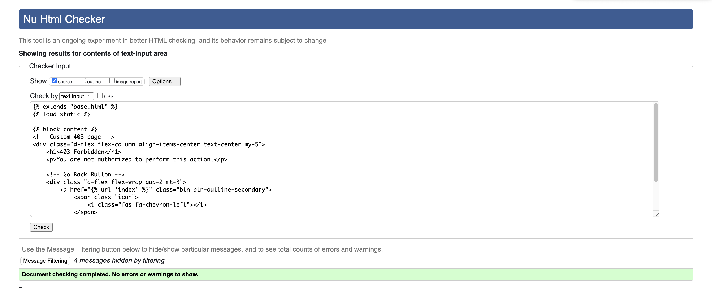
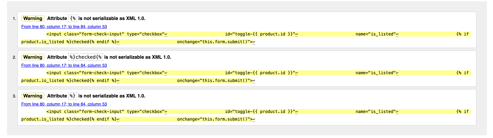

## HTML Validation

I used the [HTML W3C Validator](https://validator.w3.org) to validate my HTML files.

#### Template syntax:
- Some of the reported errors (e.g., “Bad value  for attribute href” or “Stray doctype”) are not actual code issues. They occur because the validator processes the raw Django template files, which include template tags such as  or . These tags are not part of standard HTML, so the validator flags them as invalid. Once the templates are rendered by Django, they produce valid HTML output, and those errors disappear.

#### Stray elements:
- During validation I did notice one genuine issue - a stray 
 tag - which has now been corrected. After fixing this, no further structural issues were found in the rendered pages.

#### Warnings:
- Some additional warnings remain (such as the recommendation to add lang attributes or metadata improvements). These do not affect functionality but are good practice for accessibility and SEO.
Why the validator complains about Django
The W3C validator expects plain, static HTML. Django templates, however, contain server-side directives ( and {{ ... }}) which are only resolved at runtime. To the validator, these look like “illegal characters” or “unknown tags.” For accurate validation, the check must be run on the rendered HTML (the source as delivered by the browser), not on the raw template files.

| Page | Screenshot | Notes |
| --- |--- | --- |
| 403 | | Pass: No Errors |
| 404 | | Pass: No Errors |
| 500 | | Pass: No Errors |
| Base | | Pass: No Errors |
| Checkout Buttons | | Pass: No Errors |
| Checkout Success| | Pass: No Errors |
| Checkout | | Pass: No Errors |
| Create Listing| | Pass: No Errors |
| Delete Item | | Pass: No Errors |
| Duration Form | | Pass: No Errors |
| Edit Item | | Pass: No Errors |
| Edit Profile | | Pass: No Errors |
| FAQ | | Pass: No Errors |
| Footer | | Pass: No Errors |
| Header | | Pass: No Errors |
| Index | | Pass: No Errors |
| Item Detail| | Pass: No Errors |
| Items | | Pass: No Errors |
| Listed Items| | Pass: No Errors |
| Listed Items Warn | | Continuation |
| Login | | Pass: No Errors |
| Logout | | Pass: No Errors |
| Mobile Header| | Pass: No Errors |
| Privacy Policy | | Pass: No Errors |
| Product Image | | Pass: No Errors |
| Product Info | | Pass: No Errors |
| Profile | | Pass: No Errors |
| Rented Items | | Pass: No Errors |
| Reservation Total| | Pass: No Errors |
| Reservation | | Pass: No Errors |
| Search Results | | Pass: No Errors |
| Sign Up | | Pass: No Errors |
| Terms of Service| | Pass: No Errors |

## CSS

I used the [CSS Jigsaw Validator](https://jigsaw.w3.org/css-validator) to validate my CSS files.

#### GENERAL CSS

#### CHECKOUT CSS

## JavaScript

I have used the [JS LINT](https://www.jslint.com/) to validate my JavaScript files.

### JavaScript - Linting (JSLint)
When running my files through JSLint, a few warnings appeared across files:

- “Expected '{' and instead saw 'return'”
Cause: I use single-line return statements (e.g. if (!errorDiv) return;).
Explanation: This is valid ES6 syntax but JSLint prefers full block statements ({}).
- “Expected ';' and instead saw ','”
Cause: I declare multiple variables in one line (e.g. let stripePublicKey, clientSecret;).
- Explanation: Valid in ES6+, but JSLint enforces one declaration per line.
“Unexpected ': style'”
- Cause: I pass an object property { style: style } to Stripe Elements.
Explanation: This is correct ES6 object property syntax, but JSLint sometimes flags it.

### Why I kept the code as it is? 
- These warnings are stylistic only, not runtime errors.
- The code executes correctly in all modern browsers.
- They appear because JSLint has stricter/older style rules and limited ES6+ support.

| File | Screenshot | Notes |
| --- | --- | --- |
| Card Index |  | Pass: No Errors |
| Edit Profile |  | Pass: No Errors |
| Image Preview |  | Pass: No Errors |
| Item Removal |  | Pass: No Errors |
| Items List |  | Pass: No Errors |
| Listed Items Toggle |  | Pass: No Errors |
| Price Calculator |  | Pass: No Errors |
| Stripe |  | Pass: No Errors |
| Tempus Dominus Init |  | Pass: No Errors |
| Tempus Dominus Update |  | Pass: No Errors |

## Python

I have used the [PEP8 CI Python Linter](https://pep8ci.herokuapp.com) to validate my Python files.

### Checkout

| File | Screenshot | Notes |
| --- | --- | --- |
| admin.py |  | Pass: No Errors |
| apps.py |  | Pass: No Errors |
| checkout_context.py |  | Pass: No Errors |
| forms.py|  | Pass: No Errors |
| models.py |  | Pass: No Errors |
| signals.py |  | Pass: No Errors |
| tests.py |  | Pass: No Errors |
| urls.py|  | Pass: No Errors |
| views.py |  | Pass: No Errors |
| webhook_handler.py |  | Pass: No Errors |
| webhooks.py |  | Pass: No Errors |

### Home

| File | Screenshot | Notes |
| --- | --- | --- |
| admin.py |  | Pass: No Errors |
| apps.py |  | Pass: No Errors |
| models.py |  | Pass: No Errors |
| tests.py |  | Pass: No Errors |
| urls.py |  | Pass: No Errors |
| views.py |  | Pass: No Errors |

### Items

| File | Screenshot | Notes |
| --- | --- | --- |
| admin.py |  | Pass: No Errors |
| apps.py |  | Pass: No Errors |
| forms.py |  | Pass: No Errors |
| models.py |  | Pass: No Errors |
| tests.py |  | Pass: No Errors |
| urls.py |  | Pass: No Errors |
| views.py |  | Pass: No Errors |

### Reviews

| File | Screenshot | Notes |
| --- | --- | --- |
| admin.py |  | Pass: No Errors |
| apps.py |  | Pass: No Errors |
| forms.py |  | Pass: No Errors |
| models.py |  | Pass: No Errors |
| testing.py |  | Pass: No Errors |
| urls.py |  | Pass: No Errors |
| utils.py |  | Pass: No Errors |
| views.py |  | Pass: No Errors |

### Rent-It

- I did not make any changes to settings.py because the warnings are only style-related (long lines, whitespace, inline comment spacing) and do not affect functionality. Since this file controls critical project configuration (database, AWS, Stripe, etc.), modifying it only for PEP8 compliance could introduce unnecessary risks. It is safer to keep the file as it is, since it already works correctly in development and production.

| File | Screenshot | Notes |
| --- | --- | --- |
| asgi.py |  | Pass: No Errors |
| settings.py |  | Pass: No Errors |
| urls.py |  | Pass: No Errors |
| wsgi.py |  | Pass: No Errors |

### Reservation

| File | Screenshot | Notes |
| --- | --- | --- |
| admin.py |  | Pass: No Errors |
| apps.py |  | Pass: No Errors |
| context_processors.py |  | Pass: No Errors |
| models.py |  | Pass: No Errors |
| tests.py |  | Pass: No Errors |
| urls.py |  | Pass: No Errors |
| views.py |  | Pass: No Errors |

## Browser Compatability

I have tested my site on different browsers to check for any compatability issues.

#### Firefox & Tor Browser Display Issues

- During testing, the site initially failed to load styles and scripts in Firefox and Tor. This was caused by incorrect Subresource Integrity (SRI) hashes on Bootstrap and Font Awesome CDN links, which Firefox strictly enforces, and by blocked telemetry requests from Stripe.

- Fix: Removed or replaced the broken integrity attributes with correct values, ensuring all resources load over HTTPS. Stripe telemetry errors were confirmed as non critical (payments still work) and documented. After these adjustments, the site displays consistently across Chrome, Safari, Firefox, and Tor.

| Browser | Screenshot | Notes |
| --- | --- | --- |
| Chrome |  | Works as expected |
| Safari |  | Works as expected |

### ERRORS
| Browser | Screenshot | Notes |
| --- | --- | --- |
| Tor / Firefox |  | DISPLAY ERROR |
| Tor / Firefox |  | DISPLAY ERROR |
| Firefox |  | Works as expected |
| Tor |  | Works as expected |

## Responsiveness

I have tested my site on different devices and screen sizes to check for any responsiveness problems.

### GENERAL RESPONSIVENESS MOBILE (S) - 320px
| Device | Screen |Screenshot | Notes |
| --- | --- | --- | --- |
| Mobile (Devtools)| Home Page |  | Works as expected |
| Mobile (Devtools)| Item Detail |  | Works as expected |
| Mobile (Devtools)| Rental Bag |  | Works as expected |
| Mobile (Devtools)| Checkout |  | Works as expected |
| Mobile (Devtools)| Checkout lower |  | Works as expected |
| Mobile (Devtools)| Spinner |  | Works as expected |
| Mobile (Devtools)| Confirmation |  | Works as expected |
| Mobile (Devtools)| Confirmation lower |  | Works as expected |
| Mobile (Devtools)| Rented Items |  | Works as expected |
| Mobile (Devtools)| Your Listed Items |  | Works as expected |
| Mobile (Devtools)| Create Listing |  | Works as expected |
| Mobile (Devtools)| Edit Profile |  | Works as expected |
| Mobile (Devtools)| Edit Profile lower |  | Works as expected |
| Mobile (Devtools)| Privacy Policy |  | Works as expected |
| Mobile (Devtools)| terms of Service |  | Works as expected |
| Mobile (Devtools)| FAQ |  | Works as expected |
| Mobile (Devtools)| Sign Out|  | Works as expected |
| Mobile (Devtools)| Filtered Distance Items |  | Works as expected |
| Mobile (Devtools)| Filtered Distence Items lower |  | Works as expected |

### GENERAL RESPONSIVENESS TABLET - 768px
| Device | Screen |Screenshot | Notes |
| --- | --- | --- | --- |
| Mobile (Devtools)| Home Page |  | Works as expected |
| Mobile (Devtools)| Item Detail |  | Works as expected |
| Mobile (Devtools)| Item Detail Picker |  | Works as expected |
| Mobile (Devtools)| Item Detail Calc |  | Works as expected |
| Mobile (Devtools)| Rental Bag |  | Works as expected |
| Mobile (Devtools)| Checkout |  | Works as expected |
| Mobile (Devtools)| Checkout lower |  | Works as expected |
| Mobile (Devtools)| Spinner |  | Works as expected |
| Mobile (Devtools)| Confirmation |  | Works as expected |
| Mobile (Devtools)| Confirmation lower |  | Works as expected |
| Mobile (Devtools)| Your Rentals |  | Works as expected |
| Mobile (Devtools)| Edit Profile |  | Works as expected |
| Mobile (Devtools)| Edit Profile lower |  | Works as expected |
| Mobile (Devtools)| Privacy Policy |  | Works as expected |
| Mobile (Devtools)| Terms of Service |  | Works as expected |
| Mobile (Devtools)| FAQ |  | Works as expected |
| Mobile (Devtools)| Sign Out|  | Works as expected |
| Mobile (Devtools)| Users Profile |  | Works as expected |
| Mobile (Devtools)| Create Listing |  | Works as expected |
| Mobile (Devtools)| Create Listing lower |  | Works as expected |
| Mobile (Devtools)| Your Listed Items |  | Works as expected |

### Iphone 13 REAL DEVICE TESTING

| Device | Screen |Screenshot | Notes |
| --- | --- | --- | --- |
| Iphone 13 | Home page |  | Works as expected |
| Iphone 13| Our Rooms |  | Works as expected |
| Iphone 13| Contact Us |  | Works as expected |
| Iphone 13| Reviews |  | Works as expected |
| Iphone 13| About |  | Works as expected |
| Iphone 13| Add Review |  | Works as expected |
| Iphone 13| Your Booking |  | Works as expected |
| Iphone 13| Edit Booking |  | Works as expected |
| Iphone 13| Delete Booking |  | Works as expected |
| Iphone 13| Login |  | Works as expected |
| Iphone 13| Logout|  | Works as expected |
| Iphone 13| Register |  | Works as expected |

### Samsung X Cover Pro 6 REAL DEVCE TESTIING - A few screenshots provided by a friend.

| Device | Screen |Screenshot | Notes |
| --- | --- | --- | --- |
| Samsung X Cover Pro 6 | Home page |  | Works as expected |
| Samsung X Cover Pro 6| Our Rooms |  | Works as expected |
| Samsung X Cover Pro 6| Our Rooms 2 |  | Works as expected |
| Samsung X Cover Pro 6| Our Rooms 3 |  | Works as expected |

### Real User Experience Testing. 

To complete real-world testing, I shared my website with a few older people who have basic computer experience.

I also asked one of my guests to review the website for me.

There was also one user experience story at the very beginning of testing.

The story went as follows:
My original idea for the main button in the center of the carousel was to redirect potential guests to the booking section as quickly as possible. So, the button was labeled BOOK NOW!

Later on, a person who was exploring the website told my wife that they would prefer to first see the rooms we have available. That would provide a better experience for them.

This is why I changed the BOOK NOW button to OUR ROOMS!
Now, the user is redirected to the available rooms section, where they can view the options and book the one they like.

I thought this was a good idea, so I made the changes on the website accordingly.

Below is the evidence of the user experience feedback, as well as my wife's confirmation that the website has been updated accordingly.

The last person who tested my website was my classmate David. Please see below for some screenshots of the website, along with his feedback.

## Lighthouse

I've tested my deployed project using the Lighthouse tool to check for issues.

| Page | Size | Screenshot | Notes |
| --- | --- | --- | --- |
| Home | Desktop |  | n/a |
| Our Room | Desktop |  | Small performance issue |
| Contact| Desktop |  | Best Practices due to 3rd party cookies (google maps) |
| Reviews | Desktop |  | n/a |
| Add Review | Desktop |  | n/a |
| Bookings | Desktop |  | n/a |

## WAVE EVALUATION

I tested my deployed project using the WAVE evaluation tool to assess accessibility.

All pages flagged a contrast issue related to the orange button with white text. While this does not meet standard contrast requirements, the button contains large text and is prominently sized. As it aligns with our established design patterns, we have decided to retain this styling.

| TOOL | Screen |Screenshot | 
| --- | --- | --- | 
| WAVE | Home page |  |
| WAVE | Our Rooms |  | 
| WAVE | Contact Us |  | 
| WAVE | Reviews |  |
| WAVE | About |  |
| WAVE | Add Review |  | 
| WAVE | Logout|  |

## Manual Testing

I have thoroughly tested each aspect of the website as shown below.

| **Feature**            | **User Action**                       | **Expected Result**                                                                                            | **Pass/Fail** | **Comments** |
| ------------------- | ------------------------------------- | -------------------------------------------------------------------------------------------------------------- | ------------- | ------------ |
| **Navbar**          |                                       |                                                                                                                |               |              |
|                     | Click on Logo                         | Redirects to the Home page                                                                                     | Pass          |              |
|                     | Click on Home link                    | Redirects to the Home page                                                                                     | Pass          |              |
|                     | Click on Our Room link                | Redirects to the Our Room page                                                                                 | Pass          |              |
|                     | Click on Contact link                 | Redirects to the Contact Form page                                                                             | Pass          |              |
|                     | Click on Reviews link                 | Redirects to the Reviews page                                                                                  | Pass          |              |
|                     | Click on About link                   | Redirects to the About page                                                                                    | Pass          |              |
|                     | Click on Add Review link              | Redirects to the Login page if the user is **not** authenticated; otherwise, redirects to the Add Review page  | Pass          |              |
|                     | Click on My Bookings link             | Redirects to the Login page if the user is **not** authenticated; otherwise, redirects to the My Bookings page | Pass          |              |
|                     | Click on Login link                   | Redirects the user to the Login screen                                                                         | Pass          |              |
|                     | Click on Register link                | Redirects the user to the Registration screen                                                                  | Pass          |              |
|                     | Click on Logout link                  | Redirects the user to a confirmation screen                                                                    | Pass          |              |
| **Footer**          |                                       |                                                                                                                |               |              |
|                     | Click on GITHUB ICON                  | Redirects to the GitHub page, opens in a new tab                                                               | Pass          |              |
|                     | Click on LINKEDIN ICON                | Redirects to the LinkedIn page, opens in a new tab                                                             | Pass          |              |
|                     | Click on FACEBOOK ICON                | Redirects to the Facebook page, opens in a new tab                                                             | Pass          |              |
|                     | Click on INSTAGRAM ICON               | Redirects to the Instagram page, opens in a new tab                                                            | Pass          |              |
| **OUR ROOM BUTTON** |                                       |                                                                                                                |               |              |
|                     | Click on OUR ROOM button              | Redirects to the Our Room page                                                                                 | Pass          |              |
|                     | Scroll to see our rooms               | Page presents a range of room types                                                                            | Pass          |              |
| **BOOK NOW BUTTON** |                                       |                                                                                                                |               |              |
|                     | Click on BOOK NOW button              | Redirects to the booking form                                                                                  | Pass          |              |
|                     | Scroll to see the form                | Form is visible and ready to be filled                                                                         | Pass          |              |
|                     | Click RESERVE button                  | After submitting the form, the user is redirected to My Bookings                                               | Pass          |              |
| **Your Bookings**   |                                       |                                                                                                                |               |              |
|                     | Select a booking from the table       | User selects a booking of interest                                                                             | Pass          |              |
|                     | Click EDIT button                     | User is redirected to the Edit form                                                                            | Pass          |              |
|                     | Update your booking                   | User makes changes and clicks **Update Booking**                                                               | Pass          |              |
|                     | Redirected back to MY BOOKINGS        | User sees the updated booking details                                                                          | Pass          |              |
|                     | Click DELETE                          | User is redirected to the Confirmation page                                                                    | Pass          |              |
|                     | Click CONFIRM button                  | Cancellation confirmed, user is redirected to MY BOOKINGS                                                      | Pass          |              |
|                     | Click BOOK NOW again                  | User can repeat the booking process                                                                            | Pass          |              |
| **Contact**         |                                       |                                                                                                                |               |              |
|                     | Fill the Contact Us form              | Form is filled with valid details                                                                              | Pass          |              |
|                     | Click SEND! button                    | Message is sent, and a confirmation message is shown                                                           | Pass          |              |
| **Registration**    |                                       |                                                                                                                |               |              |
|                     | Input valid email, username, password | Fields are completed correctly                                                                                 | Pass          |              |
|                     | Click Sign-Up button                  | Account is created, user is redirected to the Home page                                                        | Pass          |              |
**Login**           |                                       |                                                                                                                |               |              |
|                     | Click on Login button                 | Form appears; user fills in login credentials                                                                  | Pass          |              |
|                     | Click on Login button again           | Account is logged in                                                                                           | Pass          |              |
| **Logout**          |                                       |                                                                                                                |               |              |
|                     | Click on Logout button                | User is redirected to the confirmation page                                                                    | Pass          |              |
|                     | Click on Logout button again          | Account is logged out                                                                                          | Pass          |              |

## User Stories

Each user story has been fulfilled.

### First-time User

| User Story | Screenshot |
| --- | --- |
| As a first-time user, I want to know where the condo hotel is located. |  |
| As a first-time user, I want to see room prices and availability. | , |
| As a first-time user, I want to understand what experiences and services the condo hotel provides. | ,  |
| As a first-time user, I want to view real photos of the rooms and facilities. |  |
| As a first time user, I want to see real peoples reviews. |  |
| As a first time user I want easly navigate to booking section and create a booking. | , , , ,  |

### Returning User

| User Story | Screenshot |
| --- | --- |
| As a returning user, I want to quickly view the hotel’s location and nearby points of interest. |  |
| As a returning user, I want an easy way to contact the hotel for questions or updates to my booking. | |
| As a returning user, I want to find and follow the condo hotel on social media to stay updated on news and special offers. |  |
| As a returning user, I want to find my booking. | ,  |
| As a returning user, I want to edit or delete the booking. | ,  |
| As a returning user, I want to leave the honest review about my stay. | , ,  |

### Site Owner

| User Story | Screenshot |
| --- | --- |
| As the site owner, I want to significantly reduce admin time by making essential information easily accessible on the website. | , ,  |
| As the site owner, I want users to recognize and trust STARY CONDOHOTEL as a reliable and professional accommodation provider. | |
| As the site owner, I want users to be able to contact us easily for inquiries, support, or special requests. | |
| As the site owner, I want to capture new business opportunities through the contact form and store user data securely. |  |
| As the site owner, I want users to view high-quality images and videos that accurately represent the rooms, facilities, and surroundings. | ,  |
| As the site owner, I want users to easily find our location through an interactive map or clear directions. |  |
| As the site owner, I want to see guests reservations. |  |
| As the site owner, I want to edit or delete guests reviews. | , , ,  |
| As the site owner, I want to see messages that potential guests left by using our contact form. | , , ,  |

### BUGS

Throughout the development process, I encountered numerous bugs in my code. While it would be difficult to detail all of them here, I will highlight a few notable examples.

- Reservation Form Validation: Prevented users from selecting a check-in date in the past or a check-out date earlier than the check-in.

- Tab Title Formatting: Standardized tab title structure across all pages by adding a missing " - " (dash and space).
About Page Layout: Corrected a custom CSS class error that caused the button to stick to the footer.

- Form Layout: Fixed a typo that caused the submit button to align left instead of remaining centered.
Responsive Navigation: Repaired a broken Bootstrap link that prevented the hamburger menu from functioning on smaller screens.

- My Booking View Layout: Fixed layout issues for small screens to ensure proper responsiveness.

- 404 Page Display: Resolved an issue that prevented the custom 404 page from displaying correctly.

- Review Template Image: Corrected the image source reference to use the appropriate variable in the review template.

  THERE ARE NO OTHER BUGS I AM AWARE OF

## README

Go back to the [README.md](README.md).
