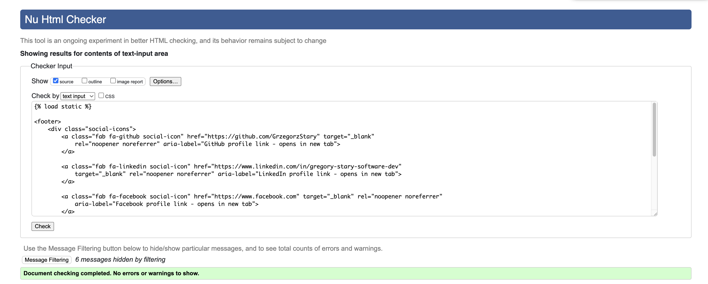
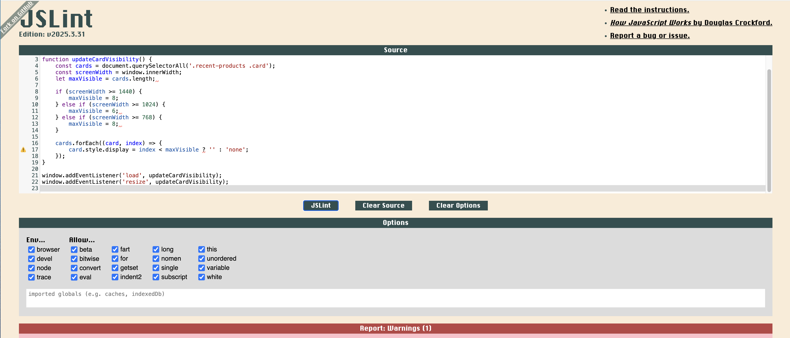
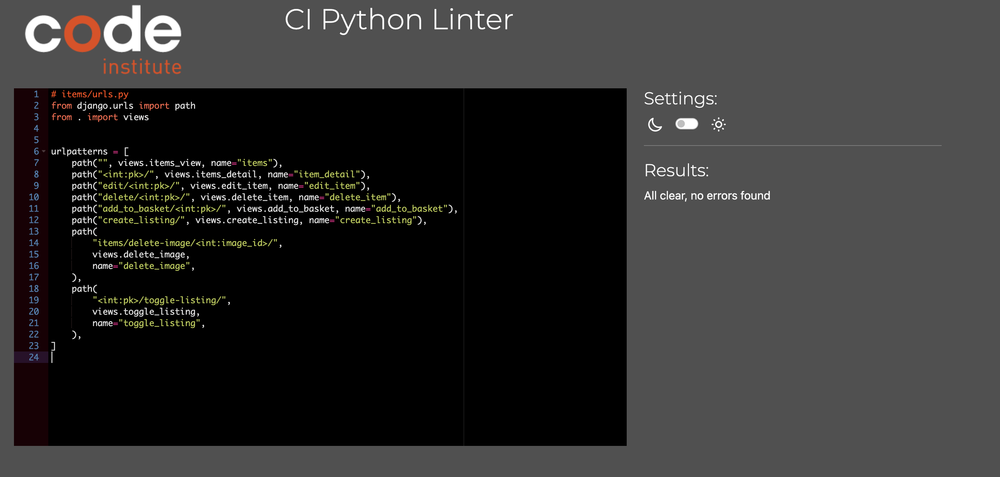
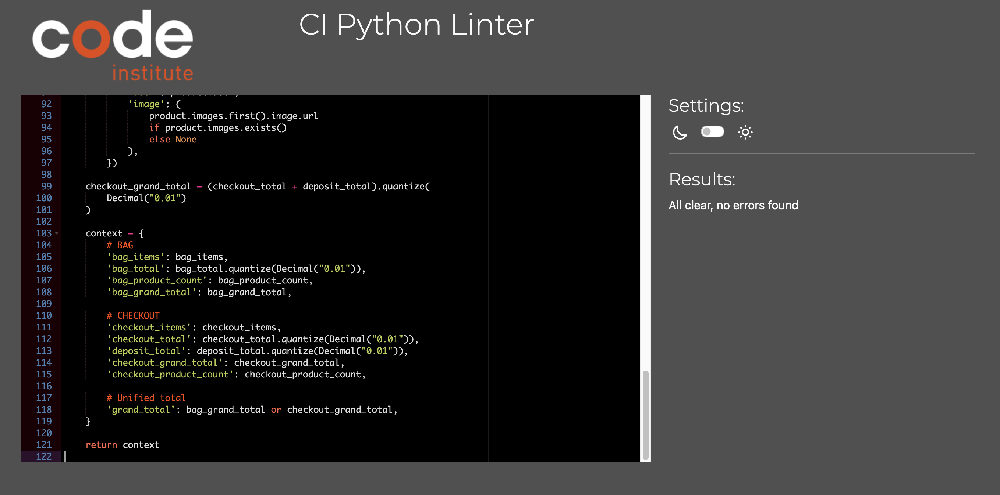
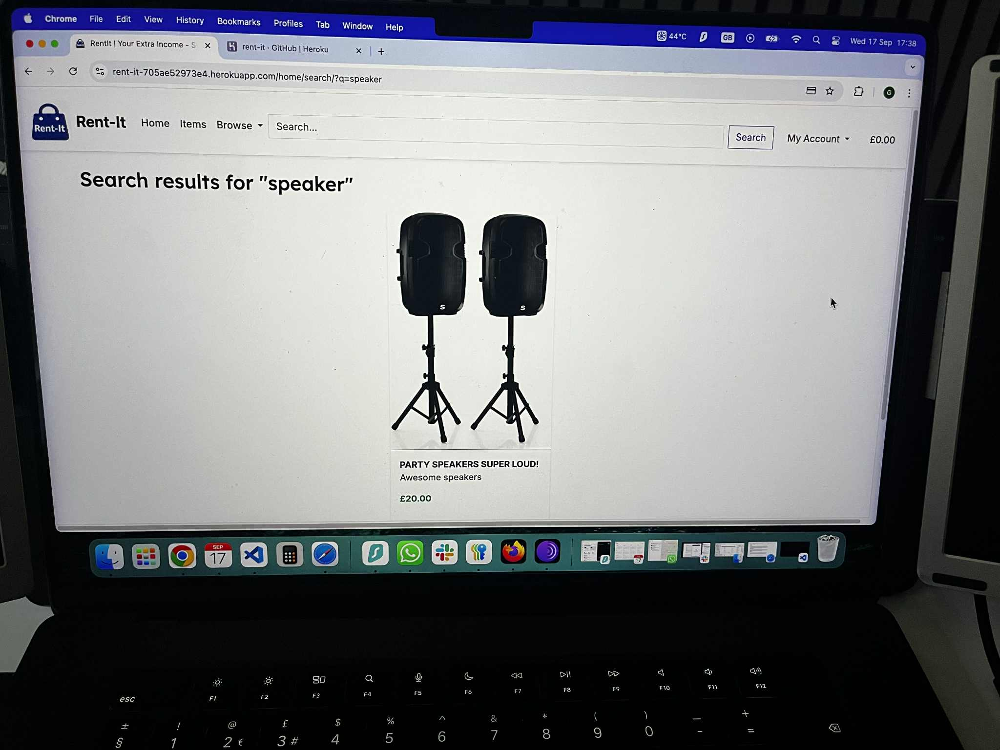
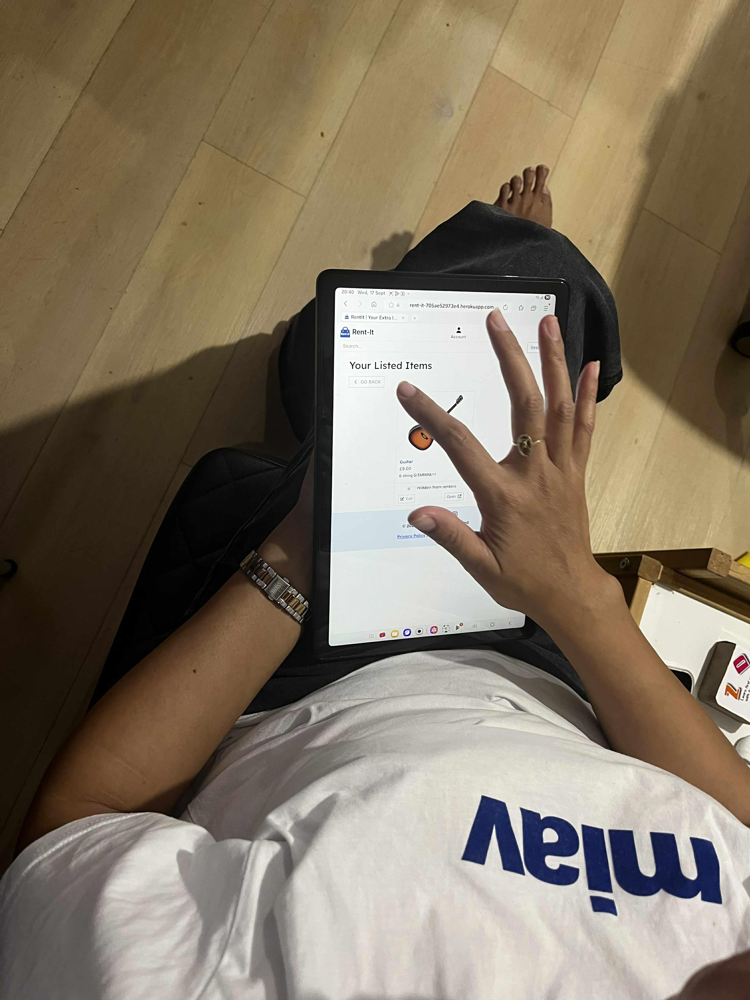
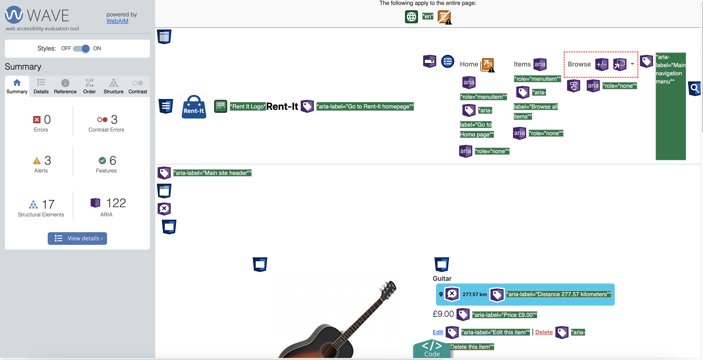
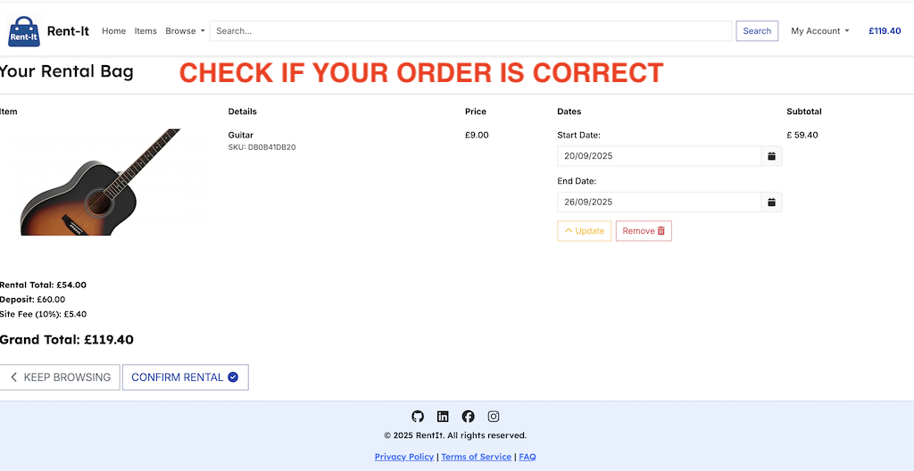
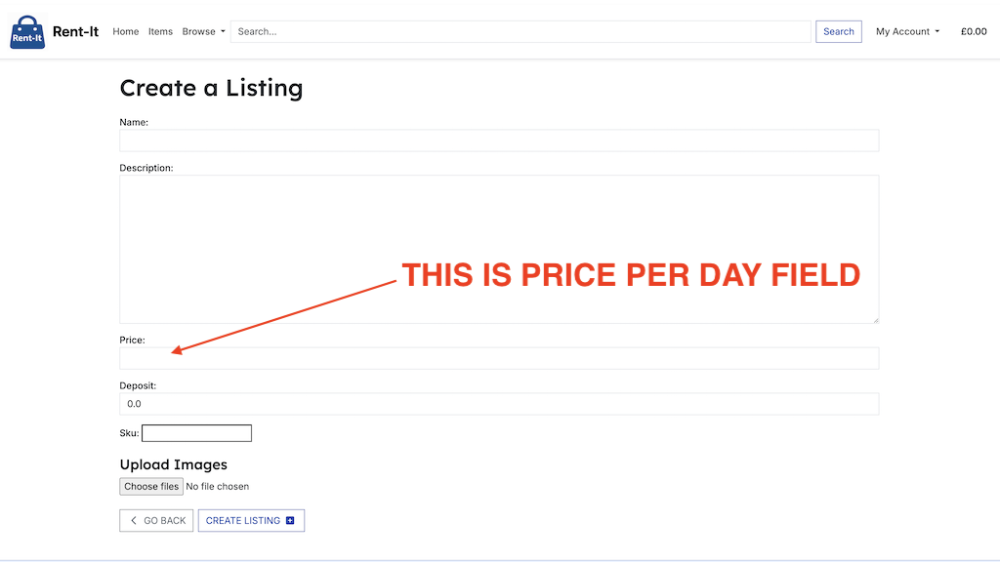

## HTML Validation

I used the [HTML W3C Validator](https://validator.w3.org) to validate my HTML files.

#### Template syntax:
- Some of the reported errors (“Bad value  for attribute href” or “Stray doctype”) are not actual code issues. They occur because the validator processes the raw Django template files, which include template tags such as  or . These tags are not part of standard HTML, so the validator flags them as invalid. Once the templates are rendered by Django, they produce valid HTML output, and those errors disappear.

#### Stray elements:
- During validation I did notice one genuine issue - a stray 
 tag - which has now been corrected. After fixing this, no further structural issues were found in the rendered pages.

#### Warnings:
- Some additional warnings remain (such as the recommendation to add lang attributes or metadata improvements). These do not affect functionality but are good practice for accessibility and SEO.
Why the validator complains about Django
The W3C validator expects plain, static HTML. Django templates, however, contain server-side directives ( and {{ ... }}) which are only resolved at runtime. To the validator, these look like “illegal characters” or “unknown tags.” For accurate validation, the check must be run on the rendered HTML (the source as delivered by the browser), not on the raw template files.

| Page | Screenshot | Notes |
| --- |--- | --- |
| 403 | | Pass: No Errors |
| 404 | | Pass: No Errors |
| 500 | | Pass: No Errors |
| Base | | Pass: No Errors |
| Checkout Buttons | | Pass: No Errors |
| Checkout Success| | Pass: No Errors |
| Checkout | | Pass: No Errors |
| Create Listing| | Pass: No Errors |
| Delete Item | | Pass: No Errors |
| Duration Form | | Pass: No Errors |
| Edit Item | | Pass: No Errors |
| Edit Profile | | Pass: No Errors |
| FAQ | | Pass: No Errors |
| Footer | | Pass: No Errors |
| Header | | Pass: No Errors |
| Index | | Pass: No Errors |
| Item Detail| | Pass: No Errors |
| Items | | Pass: No Errors |
| Listed Items| | Pass: No Errors |
| Listed Items Warn | | Continuation |
| Login | | Pass: No Errors |
| Logout | | Pass: No Errors |
| Mobile Header| | Pass: No Errors |
| Privacy Policy | | Pass: No Errors |
| Product Image | | Pass: No Errors |
| Product Info | | Pass: No Errors |
| Profile | | Pass: No Errors |
| Rented Items | | Pass: No Errors |
| Reservation Total| | Pass: No Errors |
| Reservation | | Pass: No Errors |
| Search Results | | Pass: No Errors |
| Sign Up | | Pass: No Errors |
| Terms of Service| | Pass: No Errors |

## CSS

I used the [CSS Jigsaw Validator](https://jigsaw.w3.org/css-validator) to validate my CSS files.

#### GENERAL CSS

#### CHECKOUT CSS

## JavaScript

I have used the [JS LINT](https://www.jslint.com/) to validate my JavaScript files.

### JavaScript - Linting (JSLint)
When running my files through JSLint, a few warnings appeared across files:

- “Expected '{' and instead saw 'return'”
Cause: I use single-line return statements (if (!errorDiv) return;).
Explanation: This is valid ES6 syntax but JSLint prefers full block statements ({}).
- “Expected ';' and instead saw ','”
Cause: I declare multiple variables in one line (let stripePublicKey, clientSecret;).
- Explanation: Valid in ES6+, but JSLint enforces one declaration per line.
“Unexpected ': style'”
- Cause: I pass an object property { style: style } to Stripe Elements.
Explanation: This is correct ES6 object property syntax, but JSLint sometimes flags it.

### Why I kept the code as it is? 
- These warnings are stylistic only, not runtime errors.
- The code executes correctly in all modern browsers.
- They appear because JSLint has stricter/older style rules and limited ES6+ support.

| File | Screenshot | Notes |
| --- | --- | --- |
| Card Index |  | Pass: No Errors |
| Edit Profile |  | Pass: No Errors |
| Image Preview |  | Pass: No Errors |
| Item Removal |  | Pass: No Errors |
| Items List |  | Pass: No Errors |
| Listed Items Toggle |  | Pass: No Errors |
| Price Calculator |  | Pass: No Errors |
| Stripe |  | Pass: No Errors |
| Tempus Dominus Init |  | Pass: No Errors |
| Tempus Dominus Update |  | Pass: No Errors |

## Python

I have used the [PEP8 CI Python Linter](https://pep8ci.herokuapp.com) to validate my Python files.

### Checkout

| File | Screenshot | Notes |
| --- | --- | --- |
| admin.py |  | Pass: No Errors |
| apps.py |  | Pass: No Errors |
| checkout_context.py |  | Pass: No Errors |
| forms.py|  | Pass: No Errors |
| models.py |  | Pass: No Errors |
| signals.py |  | Pass: No Errors |
| tests.py |  | Pass: No Errors |
| urls.py|  | Pass: No Errors |
| views.py |  | Pass: No Errors |
| webhook_handler.py |  | Pass: No Errors |
| webhooks.py |  | Pass: No Errors |

### Home

| File | Screenshot | Notes |
| --- | --- | --- |
| admin.py |  | Pass: No Errors |
| apps.py |  | Pass: No Errors |
| models.py |  | Pass: No Errors |
| tests.py |  | Pass: No Errors |
| urls.py |  | Pass: No Errors |
| views.py |  | Pass: No Errors |

### Items

| File | Screenshot | Notes |
| --- | --- | --- |
| admin.py |  | Pass: No Errors |
| apps.py |  | Pass: No Errors |
| forms.py |  | Pass: No Errors |
| models.py |  | Pass: No Errors |
| tests.py |  | Pass: No Errors |
| urls.py |  | Pass: No Errors |
| views.py |  | Pass: No Errors |

### Reviews

| File | Screenshot | Notes |
| --- | --- | --- |
| admin.py |  | Pass: No Errors |
| apps.py |  | Pass: No Errors |
| forms.py |  | Pass: No Errors |
| models.py |  | Pass: No Errors |
| testing.py |  | Pass: No Errors |
| urls.py |  | Pass: No Errors |
| utils.py |  | Pass: No Errors |
| views.py |  | Pass: No Errors |

### Rent-It

- I did not make any changes to settings.py because the warnings are only style related (long lines, whitespace, inline comment spacing) and do not affect functionality. Since this file controls critical project configuration (database, AWS, Stripe, etc.), modifying it only for PEP8 compliance could introduce unnecessary risks. It is safer to keep the file as it is, since it already works correctly in development and production.

| File | Screenshot | Notes |
| --- | --- | --- |
| asgi.py |  | Pass: No Errors |
| settings.py |  | Pass: No Errors |
| urls.py |  | Pass: No Errors |
| wsgi.py |  | Pass: No Errors |

### Reservation

| File | Screenshot | Notes |
| --- | --- | --- |
| admin.py |  | Pass: No Errors |
| apps.py |  | Pass: No Errors |
| context_processors.py |  | Pass: No Errors |
| models.py |  | Pass: No Errors |
| tests.py |  | Pass: No Errors |
| urls.py |  | Pass: No Errors |
| views.py |  | Pass: No Errors |

## Browser Compatability

I have tested my site on different browsers to check for any compatability issues.

#### Firefox & Tor Browser Display Issues

- During testing, the site initially failed to load styles and scripts in Firefox and Tor. This was caused by incorrect Subresource Integrity (SRI) hashes on Bootstrap and Font Awesome CDN links, which Firefox strictly enforces, and by blocked telemetry requests from Stripe.

- Fix: Removed or replaced the broken integrity attributes with correct values, ensuring all resources load over HTTPS. Stripe telemetry errors were confirmed as non critical (payments still work) and documented. After these adjustments, the site displays consistently across Chrome, Safari, Firefox, and Tor.

| Browser | Screenshot | Notes |
| --- | --- | --- |
| Chrome |  | Works as expected |
| Safari |  | Works as expected |

### ERRORS
| Browser | Screenshot | Notes |
| --- | --- | --- |
| Tor / Firefox |  | DISPLAY ERROR |
| Tor / Firefox |  | DISPLAY ERROR |
| Firefox |  | Works as expected |
| Tor |  | Works as expected |

## Responsiveness

I have tested my site on different devices and screen sizes to check for any responsiveness problems.

### GENERAL RESPONSIVENESS MOBILE (S) - 320px
| Device | Screen |Screenshot | Notes |
| --- | --- | --- | --- |
| Mobile (Devtools)| Home Page |  | Works as expected |
| Mobile (Devtools)| Item Detail |  | Works as expected |
| Mobile (Devtools)| Rental Bag |  | Works as expected |
| Mobile (Devtools)| Checkout |  | Works as expected |
| Mobile (Devtools)| Checkout lower |  | Works as expected |
| Mobile (Devtools)| Spinner |  | Works as expected |
| Mobile (Devtools)| Confirmation |  | Works as expected |
| Mobile (Devtools)| Confirmation lower |  | Works as expected |
| Mobile (Devtools)| Rented Items |  | Works as expected |
| Mobile (Devtools)| Your Listed Items |  | Works as expected |
| Mobile (Devtools)| Create Listing |  | Works as expected |
| Mobile (Devtools)| Edit Profile |  | Works as expected |
| Mobile (Devtools)| Edit Profile lower |  | Works as expected |
| Mobile (Devtools)| Privacy Policy |  | Works as expected |
| Mobile (Devtools)| terms of Service |  | Works as expected |
| Mobile (Devtools)| FAQ |  | Works as expected |
| Mobile (Devtools)| Sign Out|  | Works as expected |
| Mobile (Devtools)| Filtered Distance Items |  | Works as expected |
| Mobile (Devtools)| Filtered Distence Items lower |  | Works as expected |

### GENERAL RESPONSIVENESS TABLET - 768px
| Device | Screen |Screenshot | Notes |
| --- | --- | --- | --- |
| Tablet (Devtools)| Home Page |  | Works as expected |
| Tablet (Devtools)| Item Detail |  | Works as expected |
| Tablet (Devtools)| Item Detail Picker |  | Works as expected |
| Tablet (Devtools)| Item Detail Calc |  | Works as expected |
| Tablet (Devtools)| Rental Bag |  | Works as expected |
| Tablet (Devtools)| Checkout |  | Works as expected |
| Tablet (Devtools)| Checkout lower |  | Works as expected |
| Tablet (Devtools)| Spinner |  | Works as expected |
| Tablet (Devtools)| Confirmation |  | Works as expected |
| Tablet (Devtools)| Confirmation lower |  | Works as expected |
| Tablet (Devtools)| Your Rentals |  | Works as expected |
| Tablet (Devtools)| Edit Profile |  | Works as expected |
| Tablet (Devtools)| Edit Profile lower |  | Works as expected |
| Tablet (Devtools)| Privacy Policy |  | Works as expected |
| Tablet (Devtools)| Terms of Service |  | Works as expected |
| Tablet (Devtools)| FAQ |  | Works as expected |
| Tablet (Devtools)| Sign Out|  | Works as expected |
| Tablet (Devtools)| Users Profile |  | Works as expected |
| Tablet (Devtools)| Create Listing |  | Works as expected |
| Tablet (Devtools)| Create Listing lower |  | Works as expected |
| Tablet (Devtools)| Your Listed Items |  | Works as expected |

### Iphone 13 REAL DEVICE TESTING

| Device | Screen |Screenshot | Notes |
| --- | --- | --- | --- |
| Iphone 13 | Checkout |  | Works as expected |
| Iphone 13| Checkout lower |  | Works as expected |
| Iphone 13| Confirmation |  | Works as expected |
| Iphone 13| Confirmation lower |  | Works as expected |
| Iphone 13| Create listing |  | Works as expected |
| Iphone 13| Create listing lower |  | Works as expected |
| Iphone 13| Edit profile |  | Works as expected |
| Iphone 13| Edit profile lower |  | Works as expected |
| Iphone 13| FAQ |  | Works as expected |
| Iphone 13| Home |  | Works as expected |
| Iphone 13| Item detail|  | Works as expected |
| Iphone 13| Item detail picker |  | Works as expected |
| Iphone 13| Item detail calc |  | Works as expected |
| Iphone 13| Items |  | Works as expected |
| Iphone 13| Listed Items |  | Works as expected |
| Iphone 13| Privacy Policy|  | Works as expected |
| Iphone 13| Logout|  | Works as expected |
| Iphone 13| Profile |  | Works as expected |
| Iphone 13| Rental bag |  | Works as expected |
| Iphone 13| Rental bag lower |  | Works as expected |
| Iphone 13| Rented Items |  | Works as expected |
| Iphone 13| Rented Items |  | Works as expected |
| Iphone 13| Spinner |  | Works as expected |
| Iphone 13| Terms of Service |  | Works as expected |

### MACBOOK PRO M3 MAX 16"

| Device | Screen |Screenshot | Notes |
| --- | --- | --- | --- |
| MACBOOK PRO M3 MAX 16" | Checkout |  | Works as expected |
| MACBOOK PRO M3 MAX 16"| Checkout lower |  | Works as expected |
| MACBOOK PRO M3 MAX 16"| Confirmation |  | Works as expected |
| MACBOOK PRO M3 MAX 16"| Create Listing |  | Works as expected |
| MACBOOK PRO M3 MAX 16" | Delete Item |  | Works as expected |
| MACBOOK PRO M3 MAX 16"| Edit Item |  | Works as expected |
| MACBOOK PRO M3 MAX 16"| Edit Item lower |  | Works as expected |
| MACBOOK PRO M3 MAX 16"| Edit Profile |  | Works as expected |
| MACBOOK PRO M3 MAX 16" | FAQ |  | Works as expected |
| MACBOOK PRO M3 MAX 16"| Home |  | Works as expected |
| MACBOOK PRO M3 MAX 16"| Item Detail |  | Works as expected |
| MACBOOK PRO M3 MAX 16"| Item Detail Picker |  | Works as expected |
| MACBOOK PRO M3 MAX 16" | Item Detail Calc |  | Works as expected |
| MACBOOK PRO M3 MAX 16"| Items |  | Works as expected |
| MACBOOK PRO M3 MAX 16"| Listed Items |  | Works as expected |
| MACBOOK PRO M3 MAX 16"| Privacy Policy |  | Works as expected |
| MACBOOK PRO M3 MAX 16"| Profile |  | Works as expected |
| MACBOOK PRO M3 MAX 16"| Rental Bag |  | Works as expected |
| MACBOOK PRO M3 MAX 16"| Rented Items |  | Works as expected |
| MACBOOK PRO M3 MAX 16"| Search |  | Works as expected |
| MACBOOK PRO M3 MAX 16"| Spinner |  | Works as expected |
| MACBOOK PRO M3 MAX 16"| Tos |  | Works as expected |

### SAMSUNG TAB A9+

| Device | Screen |Screenshot | Notes |
| --- | --- | --- | --- |
| SAMSUNG TAB A9+ | Checkout |  | Works as expected |
| SAMSUNG TAB A9+| Checkout lower |  | Works as expected |
| SAMSUNG TAB A9+| Confirmation |  | Works as expected |
| SAMSUNG TAB A9+| Create Listing |  | Works as expected |
| SAMSUNG TAB A9+ | Delete Item |  | Works as expected |
| SAMSUNG TAB A9+| Edit Item |  | Works as expected |
| SAMSUNG TAB A9+| Edit Profile |  | Works as expected |
| SAMSUNG TAB A9+| Edit Profile lower |  | Works as expected |
| SAMSUNG TAB A9+ | FAQ |  | Works as expected |
| SAMSUNG TAB A9+| Home |  | Works as expected |
| SAMSUNG TAB A9+| Item Detail |  | Works as expected |
| SAMSUNG TAB A9+| Item Detail Picker |  | Works as expected |
| SAMSUNG TAB A9+ | Item Detail Calc |  | Works as expected |
| SAMSUNG TAB A9+| Items |  | Works as expected |
| SAMSUNG TAB A9+| Listed Items |  | Works as expected |
| SAMSUNG TAB A9+| Privacy Policy |  | Works as expected |
| SAMSUNG TAB A9+| Profile |  | Works as expected |
| SAMSUNG TAB A9+| Rental Bag |  | Works as expected |
| SAMSUNG TAB A9+| Rented Items |  | Works as expected |
| SAMSUNG TAB A9+| Search |  | Works as expected |
| SAMSUNG TAB A9+| Spinner |  | Works as expected |
| SAMSUNG TAB A9+| Tos |  | Works as expected |

### Real User Experience Testing. 

Real World Testing - Older User
-To complete real world testing, I shared the website with an older user who has only basic computer experience. Their assigned task was to:

- Create a new account
- Update their profile details
- Find a product to rent
- Proceed through the rental flow up to checkout
- Complete the payment step using a dummy card

### EXTRA – User Did Not Understand English

### Second Tester

The second person who tested the website was my wife. I gave her a simple end-to-end task to verify the core rental flow:

- Find a product
- Select rental dates
- Confirm that the calculated price was correct
- Navigate to the checkout page
- Complete the payment process

- Next Task - Profile & Rentals

The next task for my wife was to log into her profile and test the user account features:

- Access the profile dashboard
- Manage her own product listing visibility (toggle between visible/hidden)
- Check her active rentals
- Verify the rental details, including the location where she would need to go to pick up the item.

## Lighthouse

I've tested my deployed project using the Lighthouse tool to check for issues.

- During testing with performance and best practice auditing tools the overall Best Practice score was slightly reduced across all pages. 
This is caused by third-party cookies automatically injected by Stripe.
These cookies are essential for secure payment functionality and are beyond the control of the application. 
No action is required on the project side, and this behaviour is expected when integrating Stripe.

- The performance score was slightly reduced across several pages due to the use of large image files (particularly product images). While these images display correctly and maintain good visual quality, they increase page load times and impact Lighthouse performance results.

| Page | Size | Screenshot | Notes |
| --- | --- | --- | --- |
| Home | Desktop |  | Lower performance due to large images |
| Items | Desktop |  | n/a |
| Item detail| Desktop |  | n/a |
| Rental bag | Desktop |  | n/a |
| Rented Items | Desktop |  | n/a |
| Checkout | Desktop |  | n/a |
| Listed Items | Desktop |  | n/a |
| Profile | Desktop |  | n/a |

## WAVE EVALUATION

I tested my deployed project using the WAVE evaluation tool to assess accessibility.

- Accessibility testing flagged minor contrast issues in the footer links (FAQ, Privacy Policy, Terms of Service). 
While these links technically fall below the recommended WCAG contrast ratio, they remain legible due to the surrounding design, consistent font size, and clear spacing. As this colour scheme aligns with the established Rent-It branding, the decision was made to retain this styling.

#### On the positive side, Rent-It places a strong emphasis on inclusivity:

- The site is massively ARIA-labelled, ensuring screen readers can interpret and announce elements correctly.
Key interactive components (buttons, forms, navigation) have aria-labels and role attributes for improved accessibility.

#### This means that even users with disabilities can successfully navigate and benefit from the platform - from browsing items to listing items and completing the checkout flow, potentially improving their living standard due to extra income stream.

| TOOL | Screen |Screenshot | 
| --- | --- | --- | 
| WAVE | Home |  |
| WAVE | Items |  | 
| WAVE | Item detail |  | 
| WAVE | Rental bag |  |
| WAVE | Checkout |  |
| WAVE | Checkout error |  | 
| WAVE | Confirmation|  |
| WAVE | Edit profile |  |
| WAVE | Create listing |  |
| WAVE | Your listing |  | 
| WAVE | Your Rentals|  |

## Manual Testing

| **Feature** | **User Action** | **Expected Result** | **Pass/Fail** | **Comments** |
|-------------|-----------------|---------------------|---------------|--------------|
| **Navbar – Home** | Click "Rent-It" logo or Home link | Redirects to home page | Pass | Works as expected |
| **Navbar – Browse Items** | Click link | Opens items listing page | Pass | Shows item cards with images, name, price |
| **Navbar – My Items** | Click link | Shows user’s listed items | Pass | Displays items with edit/delete options |
| **Navbar – My Reservations** | Click link | Shows user’s reservations | Pass | Displays bookings with correct details |
| **Navbar – Profile** | Click link | Opens profile page | Pass | Info editable |
| **Navbar – Logout** | Click logout | Logs out user | Pass | Redirects to homepage |
| **Footer Links** | Click Terms/Privacy/FAQ | Opens correct page | Pass | Minor contrast issues |
| **Home Page Load** | Visit | Hero with search form | Pass | Loads search fields for tool, location, date |
| **Search Tools** | Enter keyword and submit | Shows filtered results | Pass | Returns relevant items |
| **Filter by Category** | Select category | Results update | Pass | Items narrowed correctly |
| **Location Filter** | Search by location | Filters results nearby | Pass | Map pins correct |
| **Items Map** | View map on results | Pins show item locations | Pass | Clickable markers, works with Google Maps |
| **Item Detail** | Open an item page | Shows description, price, owner | Pass | Clean layout with details |
| **Date Picker** | Select start/end dates | Valid dates accepted | Pass | Prevents invalid ranges |
| **Reserve Item** | Click Reserve after dates | Goes to Stripe checkout | Pass | Stripe checkout loads securely |
| **Stripe Payment** | Pay with test card | Booking confirmed | Pass | Appears in My Reservations |
| **Profile – View/Edit** | Change name/address | Saves changes | Pass | Updates persist |
| **My Items – Edit** | Edit listing | Updates item | Pass | Reflected in listings |
| **My Items – Delete** | Delete listing | Should remove everywhere | Pass | Note: Remains in browse until refresh |
| **Add Item** | Submit new item with image | Creates listing | Pass | Tags worked |
| **Add Item – Validation** | Leave fields empty | Shows error | Pass | Proper error messages |
| **Contact Form** | Submit valid form | Sends message | Pass | Confirmation shown |
| **Contact Form – Validation** | Leave blank/invalid email | Shows error | Pass | Inline validation works |
| **Responsive Layout** | Test on mobile | Navbar collapses, no scroll | Pass | Works as expected |
| **Accessibility – Alt Text** | Inspect images/icons | All should have alt | Pass | Works as expected |
| **Accessibility – Form Labels** | Check login form | Inputs should be labeled | Pass | Works as expected |
| **Accessibility – Keyboard Nav** | Tab through site | All reachable | Pass | Focus visible, minor datepicker issue |
| **Auth – Register** | Sign up with email | Account created | Pass | Works, password rules enforced |
| **Auth – Duplicate** | Register same email | Should error | Pass | Shows “Email already registered” |
| **Auth – Login** | Valid credentials | Logs in | Pass | User greeted by name |
| **Auth – Wrong PW** | Invalid login | Error shown | Pass | Proper feedback |
| **Auth – Google Login** | OAuth with Google | Should log in | Pass | Works as expected |
| **Auth – GitHub Login** | OAuth with GitHub | Logs in | Pass | Worked as expected |

### Postcodes.io Testing
The Postcodes.io API powers the location based search in Rent-It. To ensure the feature worked correctly, I carried out the following manual and functional tests:

| **Test**                                     | **User Action**                                           | **Expected Result**                                                          | **Pass/Fail** | **Comments**                               |
| -------------------------------------------- | --------------------------------------------------------- | ---------------------------------------------------------------------------- | ------------- | ------------------------------------------ |
| Enter a valid UK postcode (`SW1A 1AA`) | User searches for items with a valid postcode             | API returns correct latitude/longitude, items displayed within chosen radius | Pass          | Verified against Google Maps for accuracy  |
| Enter an invalid postcode (`ZZ99 9ZZ`) | User enters invalid postcode                              | API returns error, system displays validation message                        | Pass          | Error handled gracefully with feedback     |
| Leave postcode field empty                   | User submits search without postcode                      | No API call is made, system prompts for valid postcode                       | Pass          | Prevented unnecessary API calls            |
| Change search radius (5, 10, 25 km)       | User adjusts distance filter                              | Items displayed update correctly based on Haversine calculation              | Pass          | Checked against known distances            |
| Compare distance results manually            | Measured distance between two postcodes using Google Maps | Distances calculated by Rent-It closely match Google Maps distances          | Pass          | Confirms Haversine + Postcodes.io accuracy |

## User Stories

Each user story has been fulfilled.

| User Story | Screenshot |
| --- | --- |
| As a renter, I want to see total price including deposit, so I know the full cost.|     |
| As a renter, I want to pay securely via Stripe, so I can complete my booking.| ,     |
| As a user, I want to search by keyword and location, so I can find items near me. | ,    |
| As a user, I want to upload images for my listing, so that others can see what they’re renting. |      |
| As a user, I want to set a rental price per day, so I can earn income from my item. |  |
| As a renter, I want to choose rental dates, so I can reserve the item I want. |  |
| As a renter, I want to see my active and past rentals, so I can track my history. |  |
| As a user, I want to edit my profile info, so that I can update contact details or location. |   |
| As a user, I want to reset my password, so that I can recover account access. |    |
| As a user, I want to browse listings by category, so I can find what I need easily. | ,  |
| As a user, I want to view an item detail page, so I can learn more before renting. | ,  |
| As a user, I want to sign up and log in, so that I can access my account. | , ,  |
| As a user, I want to list an item for rent, so that others can view and book it. | , ,  |
| As a user, I want to set a security deposit, so I can reduce the risk of damage. | , ,  |
| As a user, I want to receive email confirmations, so I know when bookings are made. | , ,  |

### Site Owner

| User Story | Screenshot |
| --- | --- |
| As an owner, I want to see all rentals for my listed items, so I can prepare item. | , ,  |
| As the site owner, I want to show personalised dashboards, so users can manage their activity easily. | |
| As the site owner, I want to provide a clear and accessible FAQ and Terms & Conditions page, so that users understand their responsibilities and avoid misunderstandings. | |
| As the site owner, I want to delete inappropriate listings, so the site stays safe. |  |
| As the site owner, I want to limit duplicate or spam accounts, so that the community remains safe and trustworthy. | ,  |
| As the site owner, I want to support a wide variety of item types and categories, so that the platform appeals to diverse users. |  |
| As the site owner, I want to ensure secure user authentication, so that only verified users can list or rent items. |  |
| As the site owner, I want to moderate listings, so that I can remove inappropriate or fraudulent content from the platform. | , , ,  |
| As the site owner, I want to collect rental commissions via Stripe, so that I can generate revenue from the platform. | , , ,  |
| As the site owner, I want to allow users to browse listings without logging in, so that casual visitors are more likely to sign up. | , , ,  |
| As the site owner, I want to send automatic email confirmations, so users are informed about bookings and payments. | , , ,  |
| As the site owner, I want to store images on AWS S3, so media loads fast and doesn't slow down the server. | , , ,  |
| As the site owner, I want to make the site mobile-friendly, so users can browse and book rentals on the go. | , , ,  |

### Notable Bugs and Problems Encountered

Throughout the development of Rent-It, a wide range of bugs were identified and fixed. While it is impossible to list them all, the most interesting and challenging ones included:

- **Stripe Card Element Not Rendering:**  
  At one stage the Stripe card input failed to load, showing `ERR_CONNECTION_REFUSED`. This was traced to a browser/network issue blocking Stripe’s CDN. Switching script sources and cleaning up the Stripe integration resolved it.

- **Session Data & Checkout Totals:**  
  Checkout initially only displayed one item with incorrect totals. The issue was caused by how session data was populated in the reservation views. Adjustments were made to ensure multiple items and deposits calculated correctly.

- **Image Carousel Bugs:**  
  Product image carousels sometimes displayed incorrectly (only working on mobile but not on desktop, or Safari scaling problems). Fixes included unique carousel IDs per item and refined CSS (object-fit, aspect-ratio) to ensure consistent display.

- **Template Context Errors:**  
  Emails to item owners originally failed with `VariableDoesNotExist` because the template expected `item.product` while only `product` was passed in context. Updating templates to use the correct variables fixed the issue.

- **Profile Validation Gaps:**  
  Profile editing allowed blank required fields (like last name). Additional validation was added to enforce proper data integrity.

- **OAuth Social Login:**  
  While GitHub logins worked, Google login returned errors due to a misconfigured redirect URI. This highlighted the importance of correct OAuth setup across providers.

- **Static & Media on AWS:**  
  Setting up AWS S3 and linking with Heroku caused multiple issues with permissions and missing files. Correct bucket configuration (ACLs, policies, static/media separation) resolved this.

- **Accessibility and Contrast Warnings:**  
  Automated audits flagged low-contrast footer links and missing ARIA labels. While some design choices were kept for branding, ARIA labeling was improved to make the site screen reader friendly.

These challenges helped shape Rent-It into a more stable and user friendly application. 
Each bug provided valuable learning, particularly around 
**session handling, third-party integrations (Stripe, AWS, OAuth), and accessibility best practices**.

  THERE ARE NO OTHER BUGS I AM AWARE OF

## README

Go back to the [README.md](README.md).
